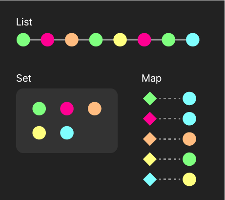
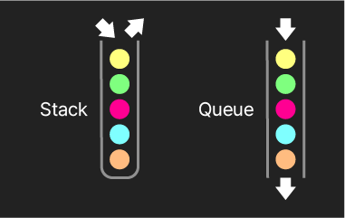
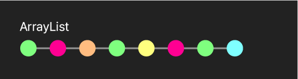
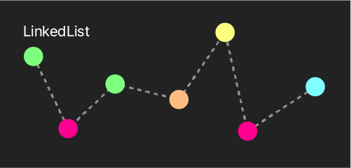
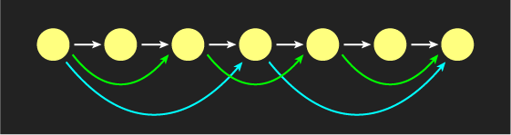

# Java Notes

## 2. 시작하기

<details>
<summary>주석, 자료형과 변수</summary>

### [2. 주석](./src/sec02/chap02)

```java
// 식별자 명명 관례
/*
 클래스: 대문자로 시작
 상수: 대문자와 _사용 PI, COMPANY_NAME
 변수나 매서드는 camal case사용 myName, addNewObject
 */
```

---

### [3. 자료형과 변수](./src/sec02/chap03)

```java
// 상수
// 💡 final 연산자 : 변수의 값을 바꾸지 못하게 만듦
final int INT_NUM = 1;
//INT_NUM = 2; // ⚠ 불가
```

</details>

---

## 3. 자료형과 연산자

<details>
<summary>정수 자료형들과 관련 연산자</summary>

### [1. 정수 자료형들과 관련 연산자](./src/sec03/chap01)

- long

```java
// ⭐ int의 범위를 벗어나는 수에는 리터럴 끝에 l 또는 L 명시 필요
long _8b_long1 = 123456789123456789L;

// 💡 가독성을 위해 아래와 같이 표현 가능 (자바7부터)
int _4b_int2 = 123_456_789;
long _8b_long2 = 123_456_789_123_456_789L;
```

- 명시적 형변환

```java
int intNum = 12345;
// ⚠ 강제로 범주 외의 값을 넣을 경우 값 손실
byte byteNum = (byte) intNum; // 💡 12345 % 128
```

- 연산

```java
byte b1 = 1;
byte b2 = 2;
short s1 = 1;
short s2 = 2;
// ⭐ byte와 short의 연산들은 int 반환
// ⚠ 아래는 모두 불가
// byte b3 = b1 + b2;
// short s3 = b1 + b2;
// short s4 = b1 + s2;
// short s5 = s1 + s2;
```

```java
long l1 = 1;
long l2 = 2;
// long끼리의 연산은 long 반환
//int l3 = l1 + l2;
```

```java
// ⚠ 정수 자료형의 계산은 소수점 아래를 '버림'
byte int1 = 5 / 2;
int int2 = 10;
int int3 = 3;
int int4 = int2 / int3;
```

```java
// 💡 자료형의 범위를 넘어가도록 숫자를 더하거나 뺄 경우 오버플로우
byte x = 127;
x +=1; // -128
byte y = -128;
y -=1; // 127
```

```java
// ⚠ 리터럴에는 단항연산자 사용 불가
// int int5 = 3++;
// int int6 = --3;
```

---

</details>

<details>
<summary>실수 자료형들</summary>

### [2. 실수 자료형들](./src/sec03/chap02)

```java
// 부동소수점 개념 알기
// 오차
boolean bool = 0.1 + 0.2 == 0.3; // false
```

- double, float

```java
// ⭐ double이 범위도 넓고, 정밀도도 높음 확인
boolean bool1 = Float.MAX_VALUE < Double.MAX_VALUE;
boolean bool2 = Float.MIN_VALUE > Double.MIN_VALUE;

// 최대 정밀도 테스트
double dblNum = 0.123456789123456789;   // 0.12345678912345678
float fltNum = 0.123456789123456789f;   // 0.12345679;
// float은 뒤에 f 또는 F를 붙여 표현
```

```java
// ⭐ 큰 수(정확히 표현가능한 한도를 넘어서는)일 경우
long lng2 = Long.MAX_VALUE; // 9223372036854775807
// 가능한 최대 정확도로
float flt4 = lng2;          // 9.223372E18
double dbl4 = lng2;         // 9.223372036854776E18
```

- 연산

```java
// float끼리의 연산은 float 반환
float flt03 = flt01 + flt02;
// float과 double의 연산은 double 반환
//float flt04 = flt01 + dbl01; // ⚠ 불가
```

```java
// 부동소수점 방식상 오차 자주 있음
// 소수부가 2의 거듭제곱인 숫자간 연산은 오차 없음
double dbl07 = 0.25 * 0.5f;
double dbl08 = 0.5 + 0.25 + 0.125 + 0.0625;
double dbl09 = 0.0625f / 0.125;
```

```java
// 💡 리터럴로 작성시 double임을 명시하려면 .0을 붙여줄 것
double dbl5 = 5 / 2;
double dbl6 = 5.0 / 2;
double dbl7 = (double) 5 / 2;

// 💡 정수 자료형에 강제로 넣으면 소수부를 '버림'
float fltNum = 4.567f;
double dblNum = 5.678;
int int2 = (int) fltNum;
int int3 = (int) dblNum;
```

---

</details>

<details>
<summary>문자 자료형, 불리언 자료형과 관련 연산자</summary>

### [3. 문자 자료형](./src/sec03/chap03)

```java
// 💡 리터럴에 더할 때와 변수에 더할 때 반환 자료형이 다름
char ch_a2 = 'A' + 1;
// char ch_a3 = ch_a1 + 1; // ⚠️ 불가
int int_a4 = ch_a1 + 1;
```

```java
// 💡 아래의 기능으로 문자가 의미하는 정수로 변환
int int_d1 = '1' - '0';
int int_d2 = '5' - '0';
int_d1 =Character.

getNumericValue('1');

int_d2 =Character.

getNumericValue('2');
```

```java
// 사전순 상 먼저 오는 쪽이 작음
boolean bool6 = 'A' < 'B';
boolean bool7 = '가' > '나';
```

---

### [4. 불리언 자료형과 관련 연산자](./src/sec03/chap04)

```java
//  💡 &&가 ||보다 우선순위 높음
boolean boolA = (num % 3 == 0) && (num % 2 == 0) || (num > 0) && (num > 10);
boolean boolB = (num % 3 == 0) && ((num % 2 == 0) || (num > 0)) && (num > 10);
```

```java
// 단축평가 short circuit
int a = 1, b = 2, c = 0, d = 0, e = 0, f = 0;

boolean bool1 = a < b && c++ < (d += 3);
boolean bool2 = a < b || e++ < (f += 3);

boolean bool3 = a > b && c++ < (d += 3);
boolean bool4 = a > b || e++ < (f += 3);
```

```java
//  💡 삼항연산자도 단축평가 적용됨
int changed1 = x < y ? (x += 2) : (y += 2);
```

---

</details>

<details>
<summary>문자열 자료형과 기초 사용법, 문자열의 메소드들</summary>

### [5. 문자열 자료형과 기초 사용법](./src/sec03/chap05)

```java
// 리터럴로 생성
String hl1 = "Hello";
String hl2 = "Hello";
String wld = "World";

//  리터럴끼리는 == 을 사용하여 비교 가능
boolean bool1 = hl1 == hl2; // true
boolean bool2 = hl1 == wld; // false

// 인스턴스로 생성
String hl3 = new String("Hello");
String hl4 = new String("Hello");
String hl5 = hl4;

//  💡 인스턴스와 비교하려면 .equals 메소드를 사용해야 함
//   특별한 경우가 아니면 문자열은 .equals로 비교할 것
boolean bool3 = hl3 == hl4; // false

boolean bool4 = hl1.equals(hl2);
boolean bool5 = hl1.equals(hl3);
boolean bool6 = hl3.equals(hl4);
boolean bool7 = wld.equals(hl2);

//  같은 곳을 참조하는 인스턴스들
boolean bool8 = hl4 == hl5; // true

//  ⭐️ 각각의 메모리상 주소 식별자 비교
int hl1hash = System.identityHashCode(hl1); // 764308918
int hl2hash = System.identityHashCode(hl2); // 764308918
int hl3hash = System.identityHashCode(hl3); // 598446861
int hl4hash = System.identityHashCode(hl4); // 1161082381
int hl5hash = System.identityHashCode(hl5); // 1161082381
```

---

### [6. 문자열의 메소드들](./src/sec03/chap06)

- concat

```java
 // concat은 필요시에만 새 인스턴스 생성
String str_b1 = "ABC";
String str_b4 = str_b1 + "";
String str_b5 = str_b1.concat("");

int str_b1Hash = System.identityHashCode(str_b1);   // 1463801669
int str_b4Hash = System.identityHashCode(str_b4);   // 355629945
int str_b5Hash = System.identityHashCode(str_b5);   // 1463801669
```

```java
//  null이 포함될 경우
String str_c1 = null;

//  + 연산자는 null과 이어붙이기 가능
String str_c3 = str_c1 + null + "ABC";

//  ⚠️ concat은 NullPointerException 발생
//String str_c4 = str_c1.concat("ABC");
//String str_c5 = "ABC".concat(str_c1);
```

```java
//  ⭐️ 다중 연산시 생성되는 문자열 인스턴스의 수가 다름
String str_d1 = "a" + "b" + "c" + "d";

// + 연산은 내부적으로 아래와 같이 최적화됨
String str_d2 = new StringBuilder("a")
        .append("b")
        .append("c")
        .append("d")
        .toString(); // "abcd"가 생성됨
// "a", "b", "c", "d", "abcd"가 생성되어 메모리 차지

//  concat은 매 번 문자열을 반환하므로
String str_d3 = "a"
        .concat("b") // "ab"가 생성됨
        .concat("c") // "abc"가 생성됨
        .concat("d"); // "abcd"가 생성됨
// "a", "b", "c", "d", "ab", "abc", "abcd"가 생성되어 메모리 차지
```

---

</details>

<details>
<summary>문자열의 포매팅과  null</summary>

### [7. 문자열의 포매팅과  null](./src/sec03/chap07)

```java
// 포매팅
/*
%b : 불리언
%d : 10진수 정수
%f : 실수
%c : 문자
%s : 문자열 (및 모든 자료형)
%n : 포맷 문자열 내 줄 바꿈 (os별로 일정하게 줄바꿈)
     윈도우: /r/n , 맥&리눅스 : /n
 */

//  💡 정수 다양하게 포매팅하기
String[] intFormats = {
        "%d",        // 1. 기본
        "%13d",      // 2. n 자리수 확보, 오른쪽 정렬
        "%013d",     // 3. 빈 자리수 0으로 채움
        "%+13d",     // 4. 양수는 앞에 + 붙임
        "%,13d",     // 5. 쉼표 사용
        "%-13d",     // 6. 자리수 확보, 왼쪽 정렬
        "%+,013d"    // 7.
};

//  💡 실수 다양하게 포매팅하기
String[] fltFormats = {
        "%f",       // 1. 기본 (소수점 6자리, 0으로 메움)
        "%.2f",     // 2. 소수점 n자리까지
        "%13.2f",   // 3. 정수자리 확보, 소수자리 제한
        "%,f",      // 4
        "%+013.2f",  // 5
        "%-13.2f",  // 6
};

//  💡 문자열 다양하게 포매팅하기
String[] strFormats = {
        "%s",    // 1. 기본
        "%9s",   // 2. 자리 확보
        "%.2s",  // 3. ~글자만
        "%9.2s", // 4.
        "%-9s",  // 5. 왼쪽 정렬
};
```

---

</details>

<details>
<summary>배열</summary>

### [8. 배열](./src/sec03/chap08)

```java
//  이중 배열
boolean[][] dblBoolAry = new boolean[3][3];

int[][] dblIntAry = new int[][]{
        //  ⭐️ 요소 배열의 크기가 다를 수 있음 // 배열의 주소가 들어감.
        {1, 2, 3},
        {4, 5},
        {6, 7, 8, 9},
};
```

```java
//  ⭐️ 문자열은 객체(참조형)지만 원시형처럼 다뤄짐
String str1 = "코인 함";
String str2 = "관심 없음";
str2 =str1;

str1 ="고점에 익절";
```

```java
//  상수 배열의 경우
final int[] NUMBERS = {1, 2, 3, 4, 5};

//  ⚠️ 다른 배열을 할당하는 것은 불가
//NUMBERS = new int[] {2, 3, 4, 5, 6};

//  ⭐️ 배열의 요소를 바꾸는 것은 가능
NUMBERS[0]=11;
```

---

</details>

<details>
<summary>타입 추론, 비트 연산자</summary>

### [9. 타입 추론](./src/sec03/chap09)

- var

---

### [10. 비트 연산자](./src/sec03/chap10)

```java
// & | ^  << ??
// & |는 단축평가를 하지 않는다.

int x = 5;              // 00101
int y = 19;             // 10011

int x_xor_y = 5 ^ 19;   // 10110
int x_or_y = 5 | 19;    // 10111
int x_and_y = 5 & 19;   // 00001

int not_X = ~5;         // 11111111 11111010    // -(5+1)
int not_Y = ~19;        // 11111111 11101100    // -(19+1)

int x_L_1 = 5 << 1;     // 01010    // 5*2
int y_L_1 = 19 << 1;    // 100110   // 19*2

int x_R_1 = 5 >> 1;     // 00010    // 5/2 몫
int y_R_1 = 19 >> 1;    // 001001   // 19/2 몫
```

</details>

---

## 4. 제어문과 메소드

<details>
<summary>if/ese, switch, for & for-each, while & do while</summary>

### [1. if/else](./src/sec04/chap01)

---

### [2. switch](./src/sec04/chap02)

```java
//  💡 break 관련 동작방식을 이용
char yutnori = '윷';

switch(yutnori){
        case'모':System.out.

println("앞으로");
    case'윷':System.out.

println("앞으로");
    case'걸':System.out.

println("앞으로");
    case'개':System.out.

println("앞으로");
    case'도':System.out.

println("앞으로"); break;
default:
        System.out.

println("무효");
}
```

---

### [3. for / for-each](./src/sec04/chap03)

```java
//  루프 블록 안에서 변수값을 바꾸는 것으로
for(int i = 0;
i< 10;){
        System.out.

println(i);

i +=2;
        }
```

```java
//  💡 쉼표로 구분하여 여럿 사용 가능
//  ⚠️ 변수의 자료형은 한 종류만 가능 (혼용 안 됨)
for(byte a = 0, b = 10;
a <=b;){
        System.out.

printf("a: %d, b: %d%n",a++, b--);
}
```

```java
 String yuts = "도개걸윷모";
char yut = '윷';

boolean isValid = false;
for(
int i = 0;
i <=yuts.

indexOf(yut);

i++){
isValid =true;
        System.out.

println("앞으로");
}
        if(!isValid)System.out.

println("무효");
```

- 무한루프

```java
//  종료조건이 없는 for 루프
for(;;){
        System.out.println("영원히");
}
// System.out.println("닿지 않아"); // ⚠️ 실행되지 않음
```

- for - each

```java
//  💡 for each 문법 - 배열이나 이후 배울 콜랙션 등에 사용
for(String s :"호롤롤로".

split("")){
        System.out.

println(s);
}
```

- labe

```java
//  💡 label : 중첩 루프에서 어느쪽을 continue, break 할 지 구분
outer:
        for(
int i = 0;
i< 10;i++){

inner:
        for(
int j = 0;
j< 10;j++){
        if(j %2==0)continue inner;
        if(i *j >=30)continue outer;

        if(j >8)break inner;
        if(i -j >7)break outer;

        System.out.

printf("i: %d, j: %d%n",i, j);
    }
            }
```

---

### [4. while & do while](./src/sec04/chap04)

---

</details>

<details>
<summary>메소드, 키보드 입력받기</summary>

### [5. 메서드](./src/sec04/chap05)

```java
//  자바의 메소드는 하나의 값만 반환 가능
//  여러 값을 반환하려면 배열 또는 객체 활용
static int[] getMaxAndMin(int[] nums) {

    int max = nums[0];
    int min = nums[0];
    for (int num : nums) {
        max = max > num ? max : num;
        min = min < num ? min : num;
    }

    return new int[]{max, min};
}
```

- ... 연산자

```java
//  💡 ... 연산자 : 해당 위치 뒤로 오는 연산자들을 배열로 묶음
//  int[] (배열 자체를 받음)과는 다름!
static double getAverage(int... nums) {
    double result = 0.0;
    for (int num : nums) {
        result += num;
    }
    return result / nums.length;
}
```

```java
static void main() {

    double avg = getAverage(3, 91, 14, 27, 4);

    //  💡 배열을 넣으면 자동으로 펼쳐져 인식됨
    int[] numbers = {3, 91, 14, 27, 4};
    double avgOfArr = getAverage(numbers);

    String class3Desc = descClass(3, "목아진", "짱구", "철수", "훈이");

    String[] kids = {"짱구", "철수", "훈이"};
    String class3DescByArr = descClass(3, "목아진", kids);
}
```

---

### [6. 메서드 더 알아보기](./src/sec04/chap06)

- 오버로딩

```java
static int add(int a, int b) {
    return a + b;
}

//  매개변수의 개수가 다름
static int add(int a, int b, int c) {
    return a + b + c;
}

//  매개변수의 자료형이 다름
static double add(double a, double b) {
    return a + b;
}

//  ⚠️ 반환 자료형이 다른 것은 오버로딩 안 됨 - 다른 함수명 사용
//  static double add(int a, int b) { return (double) (a + b); }
```

- 재귀 메소드

```java
static int factorial(int num) {
    return num == 0 ? 1 : num * factorial(--num);
}
```

꼬리 재귀 체적화

- 재귀 코드를 내부적으로 루프 형태로 바꿔서 스택이 쌓이지 않도록 함
- 자바에서는 현재 기본적으로 제공하지 않음.
- 반복 횟수가 너무 많아지는 작업에는 사용하지 말것

---

### [7. 키보드 입력받기](./src/sec04/chap07)

</details>

---

## 5. 객체지향 프로그래밍

<details>
<summary>클래스 기초, 기초 활용 예제들, 클래스(정적)필드와 메소드</summary>

### [1. 클래스 기초](./src/sec05/chap01)

```java
public class YalcoChicken {
    int no;
    String name;

    //  ⭐ 생성자(constructor) : 인스턴스를 만드는 메소드
    //  ⭐ this : 생성될 인스턴스를 가리킴
    public YalcoChicken(int no, String name) {
        this.no = no;
        this.name = name;
    }

    String intro() {
        // String name = "몽고반"; // 주석해제 시 name 대체 
        return "안녕하세요, %d호 %s점입니다."
                .formatted(no, name);
    }
}
```

---

### 2. 기초 활용 예제들(./src/sec05/chap02)

---

### 3. 클래스(정적)필드와 메소드(./src/sec05/chap03)

- 클래스(static)요소: 메모지 중 한곳만 차지
- 인스턴스 요소들: 각각이 메모리에 자리를 차지
    - 각각의 자신만의 프로퍼티 값을 가지고 있음.

`YalcoChicken.java`

```java
public class YalcoChicken {
    //  ⭐️ 클래스/정적 필드와 메소드들 : 본사의 정보와 기능
    //  인스턴스마다 따로 갖고 있을 필요가 없는 것들에 사용
    static String brand = "얄코치킨";

    static String contact() {
        //  ⚠️ 정적 메소드에서는 인스턴스 프로퍼티 사용 불가
        //  System.out.println(name);

        return "%s입니다. 무엇을 도와드릴까요?".formatted(brand);
    }

    int no;
    String name;

    YalcoChicken(int no, String name) {
        this.no = no;
        this.name = name;
    }

    String intro() {
        //  💡 인스턴스 메소드에서는 정적 프로퍼티 사용 가능
        return "안녕하세요, %s %d호 %s점입니다."
                .formatted(brand, no, name);
    }
}
```

`Main.java`

```java
//  💡 클래스 필드와 메소드는 인스턴스를 생성하지 않고 사용
String ycBrand = YalcoChicken.brand;
String ycContact = YalcoChicken.contact();

// ⚠️ 인스턴스 메소드는 불가
//  String ycName = YalcoChicken.name;
//  String ycIntro = YalcoChicken.intro();

YalcoChicken store1 = new YalcoChicken(3, "판교");
String st1Intro = store1.intro();

//  인스턴스에서는 클래스의 필드와 메소드 사용 가능
//  ⚠️ 편의상 기능일 뿐, 권장하지 않음 (혼란 초래. IDE에서 자동완성 안 됨 주목)
String st1Brand = store1.brand;
String st1Contact = store1.contact();
```

---

</details>

<details>
<summary>접근 제어자 (접근 제한자, access modifier)</summary>

### [4. 접근 제어자 (접근 제한자, access modifier)](./src/sec05/chap04)

| 접근 가능 범위           | public | protected | default | private |
|--------------------|--------|-----------|---------|---------|
| 해당 클래스 안에서         | ✅      | ✅         | ✅       | ✅       |
| 동일 패키지 안에서         | ✅      | ✅         | ✅       | ❌       |
| 다른 패키지의 자손 클래스 안에서 | ✅      | ✅         | ❌       | ❌       |
| 다른 패키지 포함 어느 곳에서든  | ✅      | ❌         | ❌       | ❌       |

- Getter와 Setter

```java
private String name;
private int price;

public String getName() {
    return name;
}

public void setName(String name) {
    if (name.isBlank()) return;
    this.name = name;
}

public int getPrice() {
    return (int) (price * (1 - discount));
}

public void setPrice(int price) {
    //  ⭐ this 사용 주의
    int max = (int) (this.price * increaseLimit);
    this.price = price < max ? price : max;
}
```

</details>

<details>
<summary>상속</summary>

### [5. 상속](./src/sec05/chap05)

`extends`키워드

- **메소드 오버라이딩**  
  부모가 가진 같은 이름의 메소드를 자식이 다르게 정의
    - **super**
        - `super`: 부모의 클래스의 인스턴스(실존하지 않음 - 자신 안의 부모 유전자)를 가리킴
            - `this` 가 해당 클래스의 인스턴스를 가리키듯…
    - 부모 클래스에 생성자가 작성되었을 시
        - 자식 클래스에도 생성자 작성 필요
        - `super` 를 사용해서 부모의 생성자를 먼저 호출
            - 즉 부모의 인스턴스부터 생성 후 이를 기반으로 자식 인스턴스 생성
            - 자식 클래스의 생성자는 `super` 로 시작해야 함 (순서 바뀌면 안됨)
    - 부모 클래스에 명시된 생서자가 없을 명우 자식 크랠스에서도 작성 필요 없음.

`Button.java`

```java
public class Button {
    private String print;

    public Button(String print) {
        this.print = print;
    }

    public void func() {
        System.out.println(print + " 입력 적용");
    }
}
```

`ShutDownButton.java`

```java
public class ShutDownButton extends Button {
    public ShutDownButton() {
        super("ShutDown"); // 💡 부모의 생성자 호출
    }

    //  💡 부모의 메소드를 override
    @Override
    public void func() {
        System.out.println("프로그램 종료");
    }
}
```

ToggleButton.java

```java
public class ToggleButton extends Button {
    private boolean on;

    public ToggleButton(String print, boolean on) {
        super(print);
        this.on = on;
    }

    @Override
    public void func() {
        super.func(); // 💡 부모에서 정의한 메소드 호출
        this.on = !this.on;
        System.out.println(
                "대문자입력: " + (this.on ? "ON" : "OFF")
        );
    }
}
```

- `@overerride` 어노테이션  
  부모의 특정 메소드를 오버라이드함을 명시
    - 없어도 오류나지 않음.
    - 메소드명이 다를 시 오류나타남. (메소드명 실수 방지)

</details>

<details>
<summary>다형성</summary>

### [6. 다형성(Polymorphism)](./src/sec05/chap06)

- 상속
    - 자식 클래스의 인스턴스는 부모 클래스 자료형에 속함

```java
//⭐️ 편의 : 모두 Button이란 범주로 묶어 배열 등에서 사용 가능
Button[] buttons = {
                new Button("Space"),
                new ToggleButton("NumLock", false),
                new ShutDownButton()
        };

for(
Button button :buttons){
        //  ⭐️ 모든 Button들은 func 메소드를 가지므로
        button.

func();
}
```

⭐️ 이처럼 특정 자료형의 자리에 여러 종류가 들어올 수 있는 것 - 다형성

- `instaneof`연산자  
  뒤에 오는 클래스의 자료형에 속하는 인스턴스인지 확인  
  상속관계가 아닌 클래스끼리는 컴파일 오류

```java
//  true
boolean typeCheck1 = button instanceof Button;
boolean typeCheck2 = toggleButton instanceof Button;
boolean typeCheck3 = shutDownButton instanceof Button;

//  false
boolean typeCheck4 = button instanceof ShutDownButton;
boolean typeCheck5 = button instanceof ToggleButton;

//  ⚠️ 컴파일 에러
// boolean typeCheck6 = toggleButton instanceof ShutDownButton;
// boolean typeCheck7 = shutDownButton instanceof ToggleButton;
```

- `object` 클래스  
  모든 클래스의 최고 조상

```java
Object[] objs = {
        1, false, 3.45, '가', "안녕하세요", new Button("Space")
};
```

</details>

<details>
<summary>클래스의 final</summary>

### [7. 클래스의 final](./src/sec05/chap07)

- `final` 필드
    - 값 변경 불가
    - 필드 선언시 또는 생성자에서 초기화해야 함 (수정이 불가능 하므로)
- `final` 메서드
    - 자식 클래스에서 오버라이드 불가
- `final` 인스턴스
    - 다른 값을 넣는 것은 불가
    - 필드는 변경 가능 (다른 인스턴스(주소)로 바뀌는게 아니라서)
- `final` 클래스
    - 하위 확장 불가 (자식 클래스 만들 수 없음)

`YalcoChicken.java`

```java
public class YalcoChicken {
    protected static final String CREED = "우리의 튀김옷은 얄팍하다.";

    private final int no;
    public String name;

    //  ⭐️ 필수 - no가 final이고 초기화되지 않았으므로
    public YalcoChicken(int no, String name) {
        this.no = no;
        this.name = name;
    }

    public void changeFinalFields() {
        // ⚠️ 불가. final 필드
        // this.no++;
    }

    public final void fryChicken() {
        System.out.println("염지, 반죽입히기, 튀김");
    }
}
```

`YalcoChickenDT.java`

```java
public final class YalcoChickenDT extends YalcoChicken {
    public YalcoChickenDT(int no, String name) {
        super(no, name);
    }

    //  ⚠️ 불가. fryChicken 메서드는 YalcoChicken 클래스의 final 메서드임
    // public void fryChicken () {
    //     System.out.println("염지, 반죽입히기, 미원, 튀김");
    // }

    // 생성자 추가할 것
}
```

`YalcoChickenHighWayDT.java`

```java
// ⚠️ 불가. YalcoChickenDT가 final 클래스임.
public class YalcoChickenHighWayDT extends YalcoChickenDT {
}
```

</details>

<details>
<summary>추상 클래스</summary>

### [8. 추상 클래스](./src/sec05/chap08)

- `abstract` 클래스
    - 자식 클래스로 파생되기 위한 클래스
    - 관련된 여러 클래스들의 공통분모를 정의하기 위한 클래스 (포유류)
    - 그 자체로는 인스턴스 생성 불가
    - 부모 클래스로서는 일반 클래스와 같음
        - 다형성 구현됨

- `abstract` 메서드
    - 추상 클래스에서만 사용 가능
    - 스스로는 선언만 하고 구현사지는 않음
        - 자식 클래스에서 반드시 구현. (아니면 컴파일 오류)
        - 접근 제한자 의미 없음(어차피 자식클래스에서 구현해야하므로)
            - 자식 클래스에서 접근 제한자 지정하면 됨
        - 클래스(정적) 메소드는 추상 메소드로 작성할 수 없음
            - 인스턴스를 생성해서 쓰는 것이 아니므로 맞지 않음

`YalcoGroup.java`

```java
public abstract class YalcoGroup {
    protected static final String CREED = "우리의 %s 얄팍하다";

    //  💡 클래스(정적) 메소드는 abstract 불가
    //  abstract static String getCreed ();

    protected final int no;
    protected final String name;

    public YalcoGroup(int no, String name) {
        this.no = no;
        this.name = name;
    }

    public String intro() {
        return "%d호 %s점입니다.".formatted(no, name);
    }

    // abstract 메소드 
    public abstract void takeOrder();
}
```

`YalcoChicken.java`

```java
public class YalcoChicken extends YalcoGroup {
    public static String getCreed() {
        return CREED.formatted("튀김옷은");
    }

    protected static int lastNo = 0;

    public YalcoChicken(String name) {
        super(++lastNo, name);
    }

    //  💡 반드시 구현 - 제거하면 컴파일 오류
    @Override
    public void takeOrder() {
        System.out.printf("얄코치킨 %s 치킨을 주문해주세요.%n", super.intro());
    }
}
```

`YalcoCafe.java`

```java
public class YalcoCafe extends YalcoGroup {
    public static String getCreed() {
        return CREED.formatted("원두향은");
    }

    protected static int lastNo = 0;

    private boolean isTakeout;

    public YalcoCafe(String name, boolean isTakeout) {
        super(++lastNo, name);
        this.isTakeout = isTakeout;
    }

    //  💡 반드시 구현 - 제거하면 컴파일 오류
    @Override
    public void takeOrder() {
        System.out.printf("얄코카페 %s 음료를 주문해주세요.%n", super.intro());
        if (!isTakeout) System.out.println("매장에서 드시겠어요?");
    }
}
```

`Main.java`

```java
//  ⚠️ abstract 클래스는 인스턴스 생성 불가
// YalcoGroup yalcoGroup = new YalcoGroup(1, "서울");

YalcoChicken ychStore1 = new YalcoChicken("판교");
YalcoChicken ychStore2 = new YalcoChicken("강남");

YalcoCafe ycfStore1 = new YalcoCafe("울릉", true);
YalcoCafe ycfStore2 = new YalcoCafe("강릉", false);

// 다형성 구현
YalcoGroup[] ycStores = {
        ychStore1, ychStore2,
        ycfStore1, ycfStore2
};

for(
YalcoGroup ycStore :ycStores){
        ycStore.

takeOrder();
}
```

---

</details>

<details>
<summary>인터페이스</summary>

### [9. 인터페이스](./src/sec05/chap09)

**추상 클래스와의 차이**

*🔴: 추상 클래스 / 🔷:인터페이스*

- 🔴 포유류
    - 북극곰 - 🔷 사냥, 🔷 수영
    - 날다람쥐 - 🔷 비행
- 🔴 파충류
    - 거북 - 🔷 수영
    - 날도마뱀 - 🔷 사냥, 🔷 수영, 🔷 비행
- 🔴 조류
    - 독수리 - 🔷 사냥, 🔷 비행
    - 펭귄 - 🔷 사냥, 🔷 수영

| 구분          | 추상 클래스             | 인터페이스                                                     |
|-------------|--------------------|-----------------------------------------------------------|
| 기본 개념       | 물려 받는 것 (혈통/가문/계열) | 장착하는 것 (학위/자격증)                                           |
| 다중 적용       | 불가 (모회사는 하나 뿐)     | 가능 (학위는 여럿 딸 수 있음)                                        |
| 상속관계에 의한 제한 | 있음                 | 없음                                                        |
| 생성자         | 가짐                 | 가지지 않음                                                    |
| 메소드         | 구상, 추상 모두 가능       | 추상 메소드 (abstract 생략 가능), 구상(default) 메소드, 클래스(static) 메소드 |
| 필드          | 모두 가능              | 상수만 가능 (public static final, 생략 가능)                       |
| 적용 연산자      | extends            | implements                                                |

`Mammal.java`

```java
public abstract class Mammal {
    public boolean hibernation;

    public Mammal(boolean hibernation) {
        this.hibernation = hibernation;
    }
}
```

`Reptile.java`

```java
public abstract class Reptile {
    public boolean isColdBlooded() {
        return true;
    }
}
```

`Hunter.java`

```java
public interface Hunter {
    String position = "포식자"; // ⭐️ final - 초기화하지 않을 시 오류

    void hunt();
}
```

`Swimmer.java`

```java
public interface Swimmer {
    void swim();
}
```

`Flyer.java`

```java
public interface Flyer {
    String aka = "날짐승"; // ⭐️ final - 초기화하지 않을 시 오류

    void fly();
}
```

`PolarBear.java`

```java
public class PolarBear extends Mammal implements Hunter, Swimmer {
    public PolarBear() {
        super(false);
    }

    @Override
    public void hunt() {
        System.out.println(position + ": 물범 사냥");
    }

    @Override
    public void swim() {
        System.out.println("앞발로 수영");
    }
}
```

`GlidingLizard.java`

```java
public class GlidingLizard extends Reptile implements Hunter, Swimmer, Flyer {
    @Override
    public void fly() {
        System.out.println("날개막으로 활강");
    }

    @Override
    public void hunt() {
        System.out.println(position + ": 벌레 사냥");
    }

    @Override
    public void swim() {
        System.out.println("꼬리로 수영");
    }
}
```

`Main.java`

```java
//  ⭐ 다형성
PolarBear polarBear = new PolarBear();
Mammal mammal = polarBear;
Swimmer swimmer = polarBear;

GlidingLizard glidingLizard = new GlidingLizard();
Eagle eagle = new Eagle();

Hunter[] hunters = {
        polarBear, glidingLizard, eagle
};

//  💡 인터페이스 역시 다형성에 의해 자료형으로 작용 가능
for(
Hunter hunter :hunters){
        hunter.

hunt();
}
```

---

**자바8에 추가된 기능들**

인터페이스의

- 클래스 메소스
- default 구상 메소드

💡`default`로 구상 메소드를 넣을 수 있도록 한 이유

- 사용되던 인터페이스에 새로운 기능을 추가해야 한다면?
    - 새로운 자바 버전의 라이브러리 인터페이스에 새 기능이 추가되어야 한다면?
    - 이를 적용하여 사용하던 클래스가 매우 많을 경우…
- 해당 인터페이스의 하위 클래스들을 일일이 수정하지 않아도 되도록
    - **하위호환성**

`FoodSafety.java`

```java
public interface FoodSafety {
    //  ⭐️
    //  static 제거하면 컴파일 오류
    //  static abstract는 역시 불가 (추상 클래스처럼)
    static void announcement() {
        System.out.println("식품안전 관련 공지");
    }

    //  ⭐️
    //  default 제거하면 컴파일 오류
    default void regularInspection() {
        System.out.println("정기 체크");
    }

    // 추상 메소드
    void cleanKitchen();

    void employeeEducation();
}
```  

`Main.java`

```java
FoodSafety.announcement();

YalcoChicken store1 = new YalcoChicken();

store1.

regularInspection();
store1.

cleanKitchen();
store1.

employeeEducation();
```

---

</details>

<details>
<summary> 싱클턴</summary>

### [10. 싱글턴](./src/sec05/chap10)

프로그램 상에서 특정 인스턴스가 딱 하나만 있어야 할 때

- 프로그램상 여러 곳에서 공유되는 설정
- 멀티쓰레딩 환경에서 공유되는 리소스
- 기타 전역으로 공유되는 인스턴스가 필요한 경우

`Setting.java`

```java
public class Setting {

    //  ⭐️ 이 클래스를 싱글턴으로 만들기

    // 클래스(정적) 필드
    // - 프로그램에서 메모리에 하나만 존재
    private static Setting setting;

    //  ⭐️ 생성자를 private으로!
    // - 외부에서 생성자로 생성하지 못하도록
    private Setting() {
    }

    //  💡 공유되는 인스턴스를 받아가는 public 클래스 메소드
    public static Setting getInstance() {
        //  ⭐️ 아직 인스턴스가 만들어지지 않았다면 생성
        //  - 프로그램에서 처음 호출시 실행됨
        if (setting == null) {
            setting = new Setting();
        }
        return setting;
    }
}
```

---
</details>

<details>
<summary>더 찾아본 내용</summary>

### 더 찾아본 내용

**클래스(정적) 메소드는 자식 클래스에서 오버라이드 될 수 있을까?**

**✔ 결론**

- ❌ **오버라이드 불가능**
- ⭕ 대신 **메서드 숨김(Method Hiding)** 발생

**🔸 이유**

- `static` 메서드는 **클래스 소속 (정적 바인딩)**
- 호출 시점이 **컴파일 타임**에 결정됨
- 따라서 **동적 바인딩(오버라이딩)**이 적용되지 않음

**🔸 추가 개념**

- `static` 메서드는 **추상 메서드로 선언할 수 없음**
    - 추상 메서드는 **인스턴스를 통해 구현/호출**되어야 함
    - `static`은 인스턴스와 무관 → 개념적으로 맞지 않음

**🔹 예제**

```java
class Parent {
    static void hello() {
        System.out.println("Parent");
    }
}

class Child extends Parent {
    static void hello() {
        System.out.println("Child");
    }
}

```

```java
Parent p = new Child();
Child c = new Child();

p.

hello(); // Parent
c.

hello();  // Child
```

</details>

---

## 6. 클래스 더 알아보기

<details>
<summary>블록과 스코프, 패키지</summary>

### [1. 블록과 스코프](./src/sec06/chap01)

```java
public class Ex02 {
    public static void main(String[] args) {
        // System.out.println(a); // ⚠️ 클래스 메소드에서 인스턴스 필드 사용 불가
    }

    // private String y = x; // ⚠️ 클래스 내 필드의 스코프 : 해당 클래스 안
    private int a = 1;
    private int b = a + 1;
    // private int c = d + 1; // ⚠️ 메소드 내 변수의 스코프 : 해당 메소드 안

    public void func1() {
        System.out.println(a + b);
        int d = 2;
    }

    public void func2() {
        // System.out.println(d); // ⚠️
    }
}
```

- 바깥의 변수 재선언 불가

`Ex03.java`

```java
 String str = "바깥쪽";
    {
            //String str = "안쪽"; // ⚠️ 불가
            }

            while(true){
            //String str = "안쪽"; // ⚠️ 불가
            }
```

`Ex04.java`

```java
public class Ex04 {

    public static void main(String[] args) {
        new Ex04().printKings();
    }

    String king = "사자";

    void printKings() {
        String king = "여우"; // 💡 그럼 이건 뭔가요??

        //  ⭐️ 인스턴스의 필드는 다른 영역으로 간주
        System.out.printf(
                "인스턴스의 왕은 %s, 블록의 왕은 %s%n",
                this.king, king
        );
    }
}
```

---

### [2. 패키지](./src/sec06/chap02)

---
</details>

<details>
<summary>내부 클래스</summary>

### [3. 내부 클래스](./src/sec06/chap03)

내부 클래스 종류

- 멤버 인스턴스
- 정적 내부 클래스
- 메소드 안에 정의된 클래스
- 익명 클래스

`Outer.java`

```java
public class Outer {
    private String inst = "인스턴스";
    private static String sttc = "클래스";

    //  💡 1. 멤버 인스턴스 클래스
    class InnerInstMember {
        //  ⭐️ 외부 클래스의 필드와 클래스 접근 가능
        private String name = inst + " 필드로서의 클래스";
        private InnerSttcMember innerSttcMember = new InnerSttcMember();

        public void func() {
            System.out.println(name);
        }
    }

    //  💡 2. 정적(클래스) 내부 클래스
    //  ⭐️  내부 클래스에도 접근자 사용 가능. private으로 바꿔 볼 것
    public static class InnerSttcMember {
        //  ⭐️ 외부 클래스의 클래스 필드만 접근 가능
        private String name = sttc + " 필드로서의 클래스";

        //  ⚠️ static이 아닌 멤버 인스턴스 클래스에도 접근 불가!
        //  private InnerInstMember innerInstMember = new InnerInstMember();

        public void func() {
            // ⚠️ 인스턴스 메소드지만 클래스가 정적(클래스의)이므로 인스턴스 필드 접근 불가
            //  name += inst;
            System.out.println(name);
        }
    }

    public void memberFunc() {
        //  💡 3. 메소드 안에 정의된 클래스
        //  스코프가 메소드 내로 제한됨
        class MethodMember {
            //  외부의 필드와 클래스에 접근은 가능
            String instSttc = inst + " " + sttc;
            InnerInstMember innerInstMember = new InnerInstMember();
            InnerSttcMember innerSttcMember = new InnerSttcMember();

            public void func() {
                innerInstMember.func();
                innerSttcMember.func();
                System.out.println("메소드 안의 클래스");

                //  new Outer().memberFunc(); // ⚠️ 스택오버플로우 에러!!
            }
        }

        new MethodMember().func();
    }

    public void innerFuncs() {
        new InnerInstMember().func();
        new InnerSttcMember().func();
    }

    public InnerInstMember getInnerInstMember() {
        return new InnerInstMember();
    }
}
```

`Main.java`

```java
package sec06.chap03.ex01;

// 내부 클래스
public class Main {
    static void main(String[] args) {
        //  ⭐️ 클래스가 클래스 필드인 것 - 아래의 변수는 인스턴스
        Outer.InnerSttcMember staticMember = new Outer.InnerSttcMember();
        staticMember.func();

        System.out.println("\n- - - - -\n");

        Outer outer = new Outer();
        outer.innerFuncs();

        System.out.println("\n- - - - -\n");


        //  ⚠️  아래와 같은 사용은 불가
        // Outer.InnerInstMember innerInstMember = new outer.InnerInstMember();
        // Outer.InnerInstMember innerInstMember = outer.new InnerInstMember(); // 가능(gpt가 알려줌.)

        //  💡 인스턴스 내부 클래스는 이렇게 얻을 수 있음
        Outer.InnerInstMember innerInstMember = outer.getInnerInstMember();
        innerInstMember.func();

        System.out.println("\n- - - - -\n");

        outer.memberFunc();
    }
}
```

---
</details>

<details>
<summary>익명 클래스</summary>

### [4. 익명 클래스](./src/sec06/chap04)

- 다른 클래스나 인터페이스로부터 상속받아 만들어짐
    - 주로 오버라이드한 메소드를 사용
- 한 번만 사용되고 버려질 클래스
    - 따로 클래스명이 부여되지 않음
    - 이후 다시 인스턴스를 생성할 필요가 없으므로
- 람다식이 나오기 전 널리 사용

```java
public interface OnClickListener {
    void onClick();
}
```

```java
public class Button {
    String name;

    public Button(String name) {
        this.name = name;
    }

    //  ⭐️ 인터페이스를 상속한 클래스 자료형
    private OnClickListener onClickListener;

    public void setOnClickListener(OnClickListener onClickListener) {
        this.onClickListener = onClickListener;
    }

    public void func() {
        onClickListener.onClick();
    }
}
```

`Main.java`

```java
Button button1 = new Button("Enter");
Button button2 = new Button("CapsLock");
Button button3 = new Button("ShutDown");

//  이후 배울 람다로 대체
button1.

setOnClickListener(new OnClickListener() {
    @Override
    public void onClick () {
        System.out.println("줄바꿈");
        System.out.println("커서를 다음 줄에 위치");
    }
});

        button2.

setOnClickListener(new OnClickListener() {
    @Override
    public void onClick () {
        System.out.println("기본입력 대소문자 전환");
    }
});

        button3.

setOnClickListener(new OnClickListener() {
    @Override
    public void onClick () {
        System.out.println("작업 자동 저장");
        System.out.println("프로그램 종료");
    }
});

        for(
Button button :new Button[]{button1,button2,button3}){
        button.

func();
}
```

---
</details>

<details>
<summary>메인 메소드, 열거형</summary>

### [5. 메인 메소드](./src/sec06/chap05)

---

### [6. 열거형](./src/sec06/chap06)

지정된 선택지 내의 값을 받을 변수 사용시

- 클래스처럼 필드, 생성자, 메소드를 가질 수 있음

```java
public enum YalcoChickenMenu {
    FR("후라이드", 10000, 0),
    YN("양념치킨", 12000, 1),
    GJ("간장치킨", 12000, 0),
    RS("로제치킨", 14000, 0),
    PP("땡초치킨", 13000, 2),
    XX("폭렬치킨", 13000, 3);

    private String name;
    private int price;
    private int spicyLevel;

    YalcoChickenMenu(String name, int price, int spicyLevel) {
        this.name = name;
        this.price = price;
        this.spicyLevel = spicyLevel;
    }

    public String getName() {
        return name;
    }

    public int getPrice() {
        return price;
    }

    public void setPrice(int price) {
        this.price = price;
    }

    public String getDesc() {
        String peppers = "";
        if (spicyLevel > 0) {
            peppers = "🌶️".repeat(spicyLevel);
        }

        return "%s %s원 %s"
                .formatted(name, price, peppers);
    }
}
```

---

</details>

<details>
<summary>레코드 (Java 16+)</summary>

### [7. 레코드 (Java 16+)](./src/sec06/chap07)

- 자바 14에서 Preview로 추가, 16에서 정식으로 등록
- 데이터의 묶음을 저장하기 위한, 단순한 형태의 클래스

- 레코드는 final
    - 다른 클래스로 상속되거나 abstract 선언 불가
- 레코드의 각 항목들은 private, final
    - 각각 같은 이름의 getter가 기본으로 만들어짐.
- 인스턴스 필드는 (자동으로 생성되며) 추가로 선언할 수 없음.
- 클래스 필드는 가능 (static)

```java
public record Child(
        String name,
        int birthYear,
        Gender gender
) {
}
```

```java
Child[] children = new Child[]{
        new Child("김순이", 2021, Gender.FEMALE),
        new Child("이돌이", 2019, Gender.MALE),
        new Child("박철수", 2020, Gender.MALE),
        new Child("최영희", 2019, Gender.FEMALE),
};

for(
Child child :children){
        System.out.

printf(
            "%s %d년생 %s 어린이%n",
            child.gender().

getEmoji(),
            child.

birthYear(),
            child.

name()
    );

```

```java
public class Button {
    public enum ClickedBy {
        LEFT('좌'), RIGHT('우');
        private char indicator;

        ClickedBy(char indicator) {
            this.indicator = indicator;
        }

        public char getIndicator() {
            return indicator;
        }
    }

    //  ⭐️
    //  다른 클래스에 내부로 포함 가능
    //  인터페이스 구현 가능 (클래스 상속은 불가)
    public record ClickInfo(
            int x, int y, ClickedBy clickedBy
    ) implements InfoPrinter {

        //  💡 클래스 필드를 가질 수 있음 (인스턴스 필드는 불가)
        static String desc = "버튼 클릭 정보";
        // string desc = "버튼 클릭 정보"; // 불가

        //  💡 인스턴스/클래스 메소드를 가질 수 있음
        @Override
        public void printInfo() {
            System.out.printf(
                    "%c클릭 (%d, %d)%n",
                    clickedBy.indicator, x, y
            );
        }
    }

    public ClickInfo func(int x, int y, ClickedBy clickedBy) {
        System.out.println("버튼 동작");
        return new ClickInfo(x, y, clickedBy);
    }
}
```

---
</details>

<details>
<summary>유용한 라이브러리 클래스들, 날짜와 시간 관련 클래스들</summary>

### [8. 유용한 라이브러리 클래스들](./src/sec06/chap08)

- 숫자 관련 클래스들
    1. Math 클래스
    2. Random 클래스
    3. BigInteger 클래스  
       Long에서 다룰 수 있는 최대 정수 이상의 수를 다름
    4. BigDecimal 클래스  
       부동소수점 오차를 해결


- 문자열 관련 클래스들
    1. StringJoiner  
       받은 문자열들을 모아서 열고 닫는 문자열과 함께 join  
       (String.join 보다 동정이고 강력)
    2. StringBuffer  
       자주 변경해야 하는 문자열이 있을 때 적합 (문자열을 여러 차례 이어붙일 때 등)
    3. StringBuilder  
       StringBuffer에서 멀티쓰레드 관련 안전 기능만 제거한 클래스
    4. CharSequence 인터페이스  
       String, StringBuffer, StringBuilder 모두 이를 구현

---

### [9. 날짜와 시간 관련 클래스들](./src/sec06/chap09)

</details>

---

## 7. 클래스와 자료형

<details>
<summary>Object</summary>

### [1. Object](./src/sec07/chap01)

- 모든 클래스의 조상
- 필드 없이 메소드들만 갖고 있음

- `@IntrinsicCandidate`: HotSpot VM (현재 대다수 JVM)에 의한 최적화
    - 작성된 코드를 보다 효율적인 내부적 동작으로 덮어씀.
- `native`: C, C++등 다른 언어로 작성된 코드를 호출하여 성능 향상
    - Java Natice Interface 사용

#### `toString` 메소드

- 기본적으로는 클래스명과 해시값을 반환
- 오버라이드해서 유용한게 사용

#### `equals` 메소드

- 기본적으로는 `==`과 같이 레퍼런스 비교
- 인스턴스 내용을 비교하려면 클래스마다 오버라이드해야 함

#### `hashCode`메소드

- 기본적으로는 각 인스턴스 고유의 메모리 위치값을 정수로 반환

`Click.java`

```java

@Override
public int hashCode() {
    return x * 100000 + y;
}
``` 

`Main.java`

```java
Click click1 = new Click(123, 456, 5323487);
Click click2 = new Click(123, 456, 5323487);
Click click3 = new Click(123, 456, 2693702);
Click click4 = new Click(234, 567, 93827345);

int click1Hash = click1.hashCode();
int click2Hash = click2.hashCode();
int click3Hash = click3.hashCode();
int click4Hash = click4.hashCode();


//  💡 Object의 toString은 내부에 hashCode 메소드 사용
//  hash코드를 오버라이드하면 기본 toString에도 영향
String click1str = click1.toString();
String click2str = click2.toString();
String click3str = click3.toString();
String click4str = click4.toString();


tring str1 = new String("Hello");
String str2 = new String("Hello");
String str3 = new String("World");

boolean bool = str1 == str2;

//  ⭐️ String 클래스 : 문자열 값이 같으면 해시값도 같도록 오버라이드 되어 있음
int str1Hash = str1.hashCode();
int str2Hash = str2.hashCode();
int str3Hash = str3.hashCode();

//  toString, equals 등도 오버라이드 되어 있음
String str1ToStr = str1.toString();
boolean str1eq2 = str1.equals(str2);
```

#### `clone` 메소드

- 인스턴스가 스스로를 복사하기 위해 사용
- `Cloneable` 인터페이스 구현 권장
- **깊은 복사**는 직접 오버라이드하여 구현해주어야 함.

`NotCloneable.java`

```java
public class NotCloneable {
    //  원시타입 필드들
    String title;
    int no;

    //  참조타입 필드들
    int[] numbers;
    Click click;
    Click[] clicks;

    public NotCloneable(String title, int no, int[] numbers, Click click, Click[] clicks) {
        this.title = title;
        this.no = no;
        this.numbers = numbers;
        this.click = click;
        this.clicks = clicks;
    }

    @Override
    protected Object clone() throws CloneNotSupportedException {

        //  💡 아래 super의 clone : 필드들을 얕은복사 해주는 Object 메소드
        //  - 원시타입 필드는 확실히 복사해줌. 참조타입은 참조복사만

        //  ⭐️ Cloneable을 구현하지 않은 클래스에서 호출하면 오류 발생!
        //  - 아래의 코드를 호출 안 하면 오류가 나지 않지만
        //  - 원시값 복사까지 일일이 구현해주어야 함
        //    - 즉 clone을 오버라이드해서 쓰는 의미 없음
        return super.clone();
    }
}
```

`Main.java`

```java
NotCloneable notCloneable = new NotCloneable(
        "클릭들 1", 1, new int[]{1, 2, 3},
        new Click(12, 34),
        new Click[]{new Click(12, 34), new Click(56, 78)}
);

NotCloneable clone1 = null;

try{
clone1 =(NotCloneable)notCloneable.

clone();
}catch(
CloneNotSupportedException e){
        System.out.

printf("⚠️ 복제중 오류 발생 : %s%n",notCloneable);
}
//  ⚠️ 복사 실패 - CloneNotSupportedException 이라는 오류 발생
```

`ShallowCopied.java`

```java
public class ShallowCopied implements Cloneable {
    String title;
    int no;

    int[] numbers;
    Click click;
    Click[] clicks;

    public ShallowCopied(String title, int no, int[] numbers, Click click, Click[] clicks) {
        this.title = title;
        this.no = no;
        this.numbers = numbers;
        this.click = click;
        this.clicks = clicks;
    }

    @Override
    protected Object clone() throws CloneNotSupportedException {

        //  Cloneable을 구현했으므로 정상 동작
        //  - 원시값만 완전히 복사됨
        return super.clone();
    }
}
```

`Main.java`

```java
ShallowCopied shallowCopied = new ShallowCopied(
        "클릭들 1", 1, new int[]{1, 2, 3},
        new Click(12, 34),
        new Click[]{new Click(12, 34), new Click(56, 78)}
);

ShallowCopied clone2 = null;
try{
clone2 =(ShallowCopied)shallowCopied.

clone();
}catch(
CloneNotSupportedException e){
        //  오류가 나지 않으므로 실행되지 않음
        System.out.

printf("⚠️ 복제중 오류 발생 : %s%n",shallowCopied);
}

shallowCopied.title ="제목 바뀜";
shallowCopied.no =2;
//  ⚠️ 참조 타입들은 완전히 복사되지 않음 (주소만 복사)
shallowCopied.numbers[0]=0;
shallowCopied.click.x =99;
shallowCopied.clicks[0].x =99;
```

`DeepCopied.java`

```java
public class DeepCopied implements Cloneable {
    String title;
    int no;

    int[] numbers;
    Click click;
    Click[] clicks;

    public DeepCopied(String title, int no, int[] numbers, Click click, Click[] clicks) {
        this.title = title;
        this.no = no;
        this.numbers = numbers;
        this.click = click;
        this.clicks = clicks;
    }

    @Override
    protected Object clone() throws CloneNotSupportedException {

        //  원시값들 복사
        DeepCopied clone = (DeepCopied) super.clone();

        //  ⭐️ 참조타입의 복사
        //  - 원시값 요소들을 하나하나 복사해 넣음

        clone.numbers = new int[numbers.length];
        for (int i = 0; i < numbers.length; i++) {
            clone.numbers[i] = numbers[i];
        }

        clone.click = new Click(click.x, click.y);

        //  이중 참조 (인스턴스의 배열)
        //  - 이중으로 복사
        clone.clicks = new Click[clicks.length];
        for (int i = 0; i < clicks.length; i++) {
            clone.clicks[i] = new Click(clicks[i].x, clicks[i].y);
        }

        return clone;
    }
}
```

`Main.java`

```java
DeepCopied deepCopied = new DeepCopied(
        "클릭들 1", 1, new int[]{1, 2, 3},
        new Click(12, 34),
        new Click[]{new Click(12, 34), new Click(56, 78)}
);

DeepCopied clone3 = null;

try{
clone3 =(DeepCopied)deepCopied.

clone();
}catch(
CloneNotSupportedException e){
        //  오류가 나지 않으므로 실행되지 않음
        System.out.

printf("⚠️ 복제중 오류 발생 : %s%n",deepCopied);
}

deepCopied.title ="제목 바뀜";
deepCopied.no =2;
deepCopied.numbers[0]=0;
deepCopied.click.x =99;
deepCopied.clicks[0].x =99;

```

---

</details>

<details>
<summary>Wrapper 클래스들, 제네릭, 게임 예제</summary>

### [2. Wrapper 클래스들](./src/sec07/chap02)

#### 박싱과 언박싱

- 원시값을 래퍼 클래스의 인스턴스로 **boxing**
- 래퍼 클래스의 인스턴스를 원시값으로 **unboxing**

#### 오토박싱과 언박싱

- 명시적으로 박싱/언박싱하지 않아도 컴파일러가 자동으로 처리
- 성능상으로는 떨어지므로 자주 자주 사용하지는 말것(반복문 안에서 등)

---

### [3. 제네릭](./src/sec07/chap03)

- 자료형을 필요에 따라 동적으로 정할 수 있도록 해줌.

#### 제네릭 메소드

```java
public class Main {
    static void main(String[] args) {

        int randNum = pickRandom(123, 456);
        boolean randBool = pickRandom(true, false);
        String randStr = pickRandom("마루치", "아라치");


        YalcoChicken store1 = new YalcoChicken("판교");
        YalcoChicken store2 = new YalcoChicken("역삼");
        YalcoChicken randStore = pickRandom(store1, store2);

        //  ⚠️ 타입이 일관되지 않고 묵시적 변환 불가하면 오류
        //  double randFlt = pickRandom("hello", "world");
        double randDbl = pickRandom(12, 34);
    }


    //  제네릭 메소드
    //  T : 타입변수. 원하는 어떤 이름으로든 명명 가능
    public static <T> T pickRandom(T a, T b) {
        return Math.random() > 0.5 ? a : b;
    }
}
```

#### 제네릭 클래스

`Pocket.java`

```java
//  원하는 자료형들로 세 개의 필드를 갖는 클래스
public class Pocket<T1, T2, T3> {
    private T1 fieldA;
    private T2 fieldB;
    private T3 fieldC;

    public Pocket(T1 fieldA, T2 fieldB, T3 fieldC) {
        this.fieldA = fieldA;
        this.fieldB = fieldB;
        this.fieldC = fieldC;
    }

    public T1 getFieldA() {
        return fieldA;
    }

    public T2 getFieldB() {
        return fieldB;
    }

    public T3 getFieldC() {
        return fieldC;
    }
}
```

`Main.java`

```java
public class Main {
    static void main(String[] args) {

        //  선언시 아래와 같이 자료형에 각 타입변수의 자료형을 명시
        //  - 제내릭에는 원시값이 아닌 참조타입(클래스)만 사용 가능 (double X / Double O)
        //  - 내부적으로 Object기반으로 동작하기 때문
        //  - (래퍼 클래스의 또 다른 존재 이유 -> 제네릭에 쓸려고)
        Pocket<Double, Double, Double> size3d1 =
                new Pocket<>(123.45, 234.56, 345.67);

        // <>를 사용 이유
        // > 를 붙이면 타입추론을 통해 자료형에 맞는 제네릭을 채워 넣게 되고, 
        // 그렇게 함으로써 의도한 바에 맞지 않은 자료형을 사용했을 때 
        // 컴파일 오류를 발생시켜 예상치 못한 문제를 차단.

        //  타입추론도 가능은 함
        var size3d2 =
                new Pocket<>(123.45, 234.56, 345.67);

        double width = size3d1.getFieldA();
        double height = size3d1.getFieldB();
        double depth = size3d1.getFieldC();

        Pocket<String, Integer, Boolean> person =
                new Pocket<>("홍길동", 20, false);

        //  제네릭 클래스는 배열 생성시 new로 초기화 필수
        Pocket<String, Integer, Boolean>[] people = new Pocket[]{
                new Pocket<>("홍길동", 20, false),
                new Pocket<>("전우치", 30, true),
                new Pocket<>("임꺽정", 27, true),
        };
    }
}
```

#### 제한된 제네릭

`Main.java`

```java
public class Main {
    static void main(String[] args) {

        double sum1 = add2Num(12, 34.56);
        // double sum2 = add2Num("1" + true); // ⚠️ 불가

        descHuntingMamal(new PolarBear());
        // descHuntingMamal(new GlidingLizard()); // ⚠️ 불가

        descFlyingHunter(new Eagle());
        descFlyingHunter(new GlidingLizard());
        // descFlyingHunter(new PolarBear()); // ⚠️ 불가


    }

    //  💡 T는 Number를 상속한 클래스이어야 한다는 조건
    public static <T extends Number> double add2Num(T a, T b) {
        return a.doubleValue() + b.doubleValue();
    }
    //  ❓ 그냥 Number를 인자 자료형으로 하면 되지 않을까?

    //  ⭐ 상속받는 클래스와 구현하는 인터페이스(들)을 함께 조건으로
    //  여기서는 클래스와 인터페이스 모두 extends 뒤에 &로 나열
    public static <T extends Mammal & Hunter & Swimmer>
    void descHuntingMamal(T animal) {
        //  ⭐️ 조건에 해당하는 필드와 메소드 사용 가능
        System.out.printf("겨울잠 %s%n", animal.hibernation ? "잠" : "자지 않음");
        animal.hunt();
    }

    public static <T extends Flyer & Hunter>
    void descFlyingHunter(T animal) {
        animal.fly();
        animal.hunt();
    }
}
```

`FormElement.java`

```java
public abstract class FormElement {
    public enum MODE {LIGHT, DARK}

    private static MODE mode = MODE.LIGHT;

    public void printMode() {
        System.out.println(mode);
    }

    abstract void func();
}
```

`Clickable.java`

```java
public interface Clickable {
    void onClick();
}

```

`FormClicker.java`

```java
public class FormClicker<T extends FormElement & Clickable> {
    private T formElem;

    public FormClicker(T formElem) {
        this.formElem = formElem;
    }

    //  ⭐️ 조건의 클래스와 인터페이스의 기능 사용 가능
    //  - 자료형의 범위를 특정해주므로
    public void printElemMode() {
        formElem.printMode();
    }

    public void clickElem() {
        formElem.onClick(); // 이 부분이 Clickable의 메소드
    }
}
```

#### 와일드 카드

`Horse.java`

```java
public class Horse<T extends Unit> {
    private T rider;

    public void setRider(T rider) {
        this.rider = rider;
    }
}
```

`HorseShop.java`

```java
public class HorseShop {
    public static void intoBestSellers(Horse<? extends Unit> horse) {
        System.out.println("베스트셀러 라인에 추가 - " + horse);
    }

    public static void intoPreminums(Horse<? extends Knight> horse) {
        System.out.println("프리미엄 라인에 추가 - " + horse);
    }

    public static void intoEntryLevels(Horse<? super Knight> horse) {
        System.out.println("보급형 라인에 추가 - " + horse);
    }
}
```

`Main.java`

```java
public class Main {
    static void main(String[] args) {

        // 아무 유닛이나 태우는 말
        Horse<Unit> avante = new Horse<>(); // ⭐️ Horse<Unit>에서 Unit 생략
        avante.setRider(new Unit());
        avante.setRider(new Knight());
        avante.setRider(new MagicKnight());

        // 기사 계급 이상을 태우는 말
        Horse<Knight> sonata = new Horse<>();   // Knight 생략
        // sonata.setRider(new Unit());    // ⚠️ 불가
        sonata.setRider(new Knight());
        sonata.setRider(new MagicKnight());

        // 마법기사만 태우는 말
        Horse<MagicKnight> grandeur = new Horse<>();
        // grandeur.setRider(new Unit());   // ⚠️ 불가
        // grandeur.setRider(new Knight());    // ⚠️ 불가
        grandeur.setRider(new MagicKnight());

        // ⚠️ 자료형과 제네릭 타입이 일치하지 않으면 대입 불가
        // - 제네릭 타입이 상속관계에 있어도 마찬가지
        // Horse<Unit> wrongHorse1 = new Horse<Knight>();
        // Horse<Knight> wrongHorse2 = new Horse<Unit>();
        // avante = sonata;
        // sonata = grandeur;

        // ⭐️ 와일드카드 - 제네릭 타입의 다형성을 위함
        // 💡 Knight와 그 자식 클래스만 받을 수 있음
        // 기사 계급 이상을 태우는 말만 대입 받을 수 있는 변수
        Horse<? extends Knight> knightHorse;
        // knightHorse = new Horse<Unit>();    // ⚠️ 불가
        knightHorse = new Horse<Knight>();
        knightHorse = new Horse<MagicKnight>();
        // knightHorse = avante;   // ⚠️ 불가
        knightHorse = sonata;
        knightHorse = grandeur;

        // 💡 Knight과 그 조상 클래스만 받을 수 있음
        // 마법기사만 태우는 말은 받지 않는 변수
        Horse<? super Knight> nonLuxuryHorse;
        nonLuxuryHorse = avante;
        nonLuxuryHorse = sonata;
        // nonLuxuryHorse = grandeur;  ⚠️ 불가

        // 💡 제한 없음 - <? extends Object> 와 동일
        // 어떤 말이든 받는 변수
        Horse<?> anyHorse;
        anyHorse = avante;
        anyHorse = sonata;
        anyHorse = grandeur;


        HorseShop.intoBestSellers(avante);
        HorseShop.intoBestSellers(sonata);
        HorseShop.intoBestSellers(grandeur);

        // HorseShop.intoPreminums(avante);    ⚠️ 불가
        HorseShop.intoPreminums(sonata);
        HorseShop.intoPreminums(grandeur);

        HorseShop.intoEntryLevels(avante);
        HorseShop.intoEntryLevels(sonata);
        // HorseShop.intoEntryLevels(grandeur);    ⚠️ 불가

        // ⭐️ 제너릭은 변수에 들어올 값에 대한 제한
        // - 데이터 그 자체에 대함이 아님
        Horse[] horses = {avante, sonata, grandeur};
        for (Horse horse : horses) {
            horse.setRider(new Unit());
        }   // ⁉️ 에러 발생하지 않음

        // 에러 발생하지 않는 이유 GPT 설명
        // ⭐️ raw type(로 타입) 사용
        // raw type 사용 시 제네릭 타입 정보가 사라져 컴파일 타임 타입 체크가 불가능해짐 (타입 안전성 깨짐)
        // - Horse[] 는 제네릭 타입 정보(<T>)가 제거된 상태
        // - Horse<Unit>, Horse<Knight>, Horse<MagicKnight> 구분이 사라짐

        // ⭐️ 컴파일 에러가 발생하지 않는 이유
        // - raw type에서는 제네릭 타입이 Object로 처리됨
        // - 즉, setRider(Object rider) 형태로 동작
        // - 따라서 어떤 타입이든 전달 가능 (타입 체크 안 함)

        // ⚠️ 문제점
        // - 제네릭 타입 검사가 사라져 타입 안정성이 깨짐
        // - 예: Horse<MagicKnight>에 Unit이 들어갈 수 있음

        // ⚠️ 이후 값 꺼낼 때 문제 발생 가능
        // - 내부적으로 MagicKnight로 캐스팅 시도
        // - 실제로 Unit이 들어있으면 ClassCastException 발생 (런타임 에러)


        // ✅ 안전한 방법 (와일드카드 사용)
        Horse<?>[] safeHorses = {avante, sonata, grandeur};

        for (Horse<?> horse : safeHorses) {
            // ❌ 컴파일 에러 발생
            // - ? 는 "정확한 타입을 모름" 의미
            // - 따라서 setRider(...) 호출 불가 (타입 안전성 유지)
            // horse.setRider(new Unit());
        }

    }
}
```

---

### [4. 게임 예제](./src/sec07/chap04)

</details>

---

## 8. 컬렉션 프레임워크

<details>
<summary>컬렉션 프레임워크</summary>

### 1. 컬렉션 프레임워크

#### 널리 사용되는 컬렉션 클래스들

🔴 : 추상 클래스 / 🔷 : 인터페이스 / ⭐️ : 클래스

`📁 java.util` 패키지

- 🔴 AbstractCollection - 🔷 Collection
    - 🔴 AbstractList - 🔷 List
        - ⭐️ ArrayList
        - 🔴 AbstractSequentialList
            - ⭐️ LinkedList
        - ⭐️ Vector
            - ⭐️ Stack
    - 🔴 AbstractSet - 🔷 Set
        - ⭐️ HashSet
            - ⭐️ LinkedHashSet
        - ⭐️ TreeSet
- 🔴 AbstractMap - 🔷 Map
    - ⭐️ HashMap
        - ⭐️ LinkedHashMap
    - ⭐️ TreeMap

#### 컬랙션 종류 구분



- 💡 리스트 **list**
    - 순서가 있는 요소들의 컬렉션
        - 크기가 변할 수 있는 배열
    - 중복 허용
- 💡셋 **set**
    - 중복되지 않는 요소들의 컬렉션
    - *기본적으로는* 순서가 없음
- 💡맵 **map**
    - 키와 값의 쌍으로 이루어진 요소들의 컬렉션
    - 키는 중복될 수 없음
        - 값은 중복 가능
    - 키마다 하나의 값이 있음

#### 스택(stack) vs 큐 (queue)



- 스택 : 후입선출 (**L**ast **I**n **F**irst **O**ut)
    - 나중에 들어온 것이 먼저 나옴
- 큐 : 선입선출 (**Queue** : **F**irst **I**n **F**irst **O**ut)
    - 먼저 들어간 것이 먼저 나옴
- 예전에는 `Stack` 등의 클래스로 사용했었음
    - 오늘날에는 다음 강에 배울 `LinkedList` 등으로 모두 구현

---
</details>

<details>
<summary>리스트</summary>

### [2. 리스트](./src/sec08/chap02)

#### `ArrayList`

- 가장 많이 사용되는 컬렉션 클래스



- 배열과 달리, 크기가 동적으로 증가 가능
    - 지정하지 않을 시 초기 공간 10
        - 공간 _(capacity)_ ≠ 요소의 수 _(size)_
    - 배열처럼 메모리상에 연속으로 나열
        - 그래서 Array(배열)List
    - 공간 초과 시 추가 공간 확보
        - 더 넓은 공간을 확보한 뒤 요소들 복사
            - 더 넓은 땅으로 이주하는 개념
    - 중간의 요소 제거 시 이후 요소들 당겨옴
- 용도
    - 장점 : 각 요소들로의 접근이 빠름
    - 단점 : 요소 추가/제거 시 성능 부하, 메모리 더 차지
    - 변경이 드물고 빠른 접근이 필요한 곳에 적합

#### `LinkedList`

- Queue를 구현하는 용도로 사용 가능
- 기능상 `ArrayList`와 대다수 주요 기능 공유



- 각 요소들이 메모리 이곳 저곳에 산재
    - 각각 이전/다음 요소들로의 링크가 있음
        - 비상연락망 체계…
    - 요소 추가시 해당 요소의 메모리만 확보 후 링크
    - 요소 제거시 그 이전 요소와 다음 요소 연결
- 용도
    - 장점 : 요소의 추가와 제거가 빠름, 메모리 절약
    - 단점 : 요소 접근이 느림
    - 요소들의 추가/제거가 잦은 곳에 적합

#### 실무에서는 컬렉션 자료형을 인터페이스로

```java
List<Integer> intList = new ArrayList<>();
intList =new LinkedList<>();

Set<String> strSet = new HashSet<>();
strSet =new TreeSet<>();

Map<Integer, String> intStrMap = new HashMap<>();
intStrMap =new TreeMap<>();
```

- `List` , `Set` , `Map` 등의 인터페이스로 변수, 인자, 제네릭 등의 자료형 지정
    - 상세구현이 어떤 알고리즘으로 되어있는지는 굳이 드러내지 않음
    - 필요에 따라 다른 종류로 교체가 용이

---
</details>

<details>
<summary>셋, 맵</summary>

### [3. 셋](./src/sec08/chap03)

| 주요 클래스          | 장점                        | 단점                     |
|-----------------|---------------------------|------------------------|
| `HashSet`       | 성능이 빠르고 메모리를 적게 사용        | 순서를 보장하지 않음            |
| `LinkedHashSet` | 요소들을 입력 순서대로 유지           | `HashSet`보다 성능이 다소 떨어짐 |
| `TreeSet`       | 요소들을 특정 기준으로 정렬 (기본 오름차순) | 추가/삭제 시 시간이 더 소모됨      |

---

### [4. 맵](./src/sec08/chap04)

- 키 key와 값 value의 쌍
- 키와 값의 자료형은 다양하게 가능
- 키 값은 중복될 수 없음

**해시맵과 트리맵**

- 키를 저장하는 방식에 있어 해시셋/트리셋과 같음
    - 해시맵: 키의 해시코드 / 키
    - 트리맵: 키를 트리 형태로 저장
- 정렬 무관 빠른 접근시에는 해시맵, 키순으로 정렬 필요시 트리맵

---
</details>

<details>
<summary>Comparable & Comparator</summary>

### [5.Comparable & Comparator](./src/sec08/chap05)

- 둘 모두 인터페이스
- `Comparable` (비교의 대상): 자신과 다른 객체를 비교
    - 숫자 클래드들, 불리언, 문자열
    - `Date`, `BigDecimal`, `BigInteger` 등
- `Comparator` (비교의 주체): 주어진 두 객체를 비교
    - 컬렉션에서는 정렬의 기준으로 사용
    - `Arrays`의 정렬 메소드, `TreeSet`이나 `TreeMap`등의 생성자에 활용

`Person.java`

```java
public class Person implements Comparable<Person> {
    private static int lastNo = 0;
    private int no;
    private String name;
    private int age;
    private double height;

    public Person(String name, int age, double height) {
        this.no = ++lastNo;
        this.name = name;
        this.age = age;
        this.height = height;
    }

    public int getNo() {
        return no;
    }

    public String getName() {
        return name;
    }

    public int getAge() {
        return age;
    }

    public double getHeight() {
        return height;
    }

    @Override
    public int compareTo(Person p) {
        return this.getName()
                .compareTo(p.getName());
    }

    @Override
    public String toString() {
        return "Person{" +
                "no=" + no +
                ", name'" + name + '\'' +
                ", age=" + age +
                ", height=" + height +
                '}';
    }
}
```

`PersonComp.java`

```java
public class PersonComp implements Comparator<Person> {
    public enum SortBy {NO, NAME, AGE, HEIGHT}

    public enum SortDir {ASC, DESC}

    private SortBy sortBy;
    private SortDir sortDir;

    public PersonComp(SortBy sortBy, SortDir sortDir) {
        this.sortBy = sortBy;
        this.sortDir = sortDir;
    }

    @Override
    public int compare(Person o1, Person o2) {
        int result = 0;
        switch (sortBy) {
            case NO:
                result = o1.getNo() > o2.getNo() ? 1 : -1;
                break;
            case NAME:
                result = o1.getName()
                        .compareTo(o2.getName());
                break;
            case AGE:
                result = o1.getAge() > o2.getAge() ? 1 : -1;
                break;
            case HEIGHT:
                result = o1.getHeight() > o2.getHeight() ? 1 : -1;
                break;
        }

        return result * (sortDir == SortDir.ASC ? 1 : -1);
    }
}
```

`Main.java`

```java
public class Main {
    static void main(String[] args) {
        TreeSet[] treeSets = {
                new TreeSet<>(),    // name기준으로 정렬됨.
                new TreeSet<>(new PersonComp(PersonComp.SortBy.NO, PersonComp.SortDir.DESC)),
                new TreeSet<>(new PersonComp(PersonComp.SortBy.AGE, PersonComp.SortDir.ASC)),
                new TreeSet<>(new PersonComp(PersonComp.SortBy.HEIGHT, PersonComp.SortDir.DESC))
        };

        for (Person p : new Person[]{
                new Person("홍길동", 20, 174.5),
                new Person("전우치", 28, 170.2),
                new Person("임꺽정", 24, 183.7),
                new Person("황대장", 32, 168.8),
                new Person("붉은매", 18, 174.1)
        }) {
            for (TreeSet ts : treeSets) {
                ts.add(p);
            }
        }

        for (TreeSet ts : treeSets) {
            for (Object p : ts) {
                System.out.println(p);
            }
            System.out.println("\n- - - - -\n");
        }
    }
}
```

---
</details>

<details>
<summary>이터레이터</summary>

### [6. 이터레이터](./src/sec08/chap06)

- `java.lang.Iterable` 인터페이스 구현 클래스에서 사용
- 컬렉션을 순회하는데 사용
    - 투어가이드, 순시 감찰관 역할
    - 특정 기준의 요소들 제거에 유용
    - 순회 상태가 저장될 필요가 있을 때 유용

`Main.java`

```java
Set<Integer> intHSet = new HashSet<>(
        Arrays.asList(1, 2, 3, 4, 5, 6, 7, 8, 9)
);
// 이레이터 반환 및 초기화
// - 기타 Collection 인터페이스를 구현한 클래스들에도 존재
Iterator<Integer> intItor = intHSet.iterator();

// next : 자리를 옮기며 다음 요소 반환
Integer int1 = intItor.next();
Integer int2 = intItor.next();
Integer int3 = intItor.next();

// hasNext : 순회가 끝났는지 여부 반환
boolean hasNext = intItor.hasNext();

// 순회 초기화
intItor =intHSet.

iterator();

// remove : 현 위치의 요소 삭제
while(intItor.

hasNext()){
        if(intItor.

next()%3==0){
        intItor.

remove();
    }
            }

// foreach 문으로 시도하면 오류
// for(Integer num : intHSet)
// {
//     if(num%3 ==0) intHSet.remove(num);
// }
```

</details>

---

## 9. 함수형 프로그래밍

<details>
<summary>람다식과 함수형 인터페이스</summary>

### [1. 람다식과 함수형 인터페이스](./src/sec09/chap01)

#### 람다식 lambda expression

- 자바8에 추가된 기능
- 메서드를 간단히 식 expression으로 표현
- **익명 함수** anonymous function이라고도 부름.
- 자바에서는 인터페이스의 익명 클래스를 간략히 표현하는데 사용됨

#### 함수형 인터페이스 FunctionalInterface

- 람다식 형태로 익명 클래스가 만들어질 수 있는 인터페이스
    - 조건: 추상 메소드가 하나(만)있어야 함
        - 람다식과 1:1로 대응될 수 있어야 하므로
        - `@FunctionalInterface`로 강제
        - 클래스 메소드와 `default`메소드는 여럿 있을 수 있음
        - ⭐ 예외: `java.util.Comparator`는 함수형 인터페이스지만 추상 메소드가 둘
            - 자바 8 (함수형 인터페이스 등장)이전에 만들어진 클래스이기 때문
            - 사용자가 정의할 부분은 `compare`메소드만
                - `equals`는 이미 Object 클래스에 있으므로 구현 대상이 아님

`Printer.java`

```java

@FunctionalInterface
public interface Printer {
    void print();

    // void say (); // ⚠️ 둘 이상의 메소드는 불가
}
```

`Main.java`

```java
Printer printer1 = new Printer() {
    @Override
    public void print() {
        System.out.println("람다식이 없었을 때 방식");
    }
};

Printer printer2 = () -> {
    System.out.println("인자도 반환값도 없는 람다식");
};
Printer printer3 = () -> System.out.println("반환값 없을 시 { } 생략 가능");
Printer printer4 = () -> {
    System.out.println("코드가 여러 줄일 때는");
    System.out.println("{ } 필요");
};

for(
Printer p :new Printer[]{printer1,printer2,printer3,printer4}){
        p.

print();
}
```

---
</details>

<details>
<summary>java.util.function패키지</summary>

### [2. java.util.function패키지](./src/sec09/chap02)

- 자바는 람다식을 위한 함수형 인터페이스가 정의되어 있어야 함.
    - 필요할 때마다 정의해야하므로 번거로움
    - 자주 사용하는 인터페이스가 java.util.function패키지에 제공
    - 스트림에서 유용하게 사용

| 함수형 인터페이스                    | 메서드      | 인자(들) 타입 | 반환값 타입    |
|------------------------------|----------|----------|-----------|
| `Runnable` (`java.lang` 패키지) | `run`    | 없음       | `void`    |
| `Supplier<T>`                | `get`    | 없음       | `T`       |
| `Consumer<T>`                | `accept` | `T`      | `void`    |
| `BiConsumer<T, U>`           | `accept` | `T, U`   | `void`    |
| `Function<T, R>`             | `apply`  | `T`      | `R`       |
| `BiFunction<T, U, R>`        | `apply`  | `T, U`   | `R`       |
| `Predicate<T>`               | `test`   | `T`      | `boolean` |
| `BiPredicate<T, U>`          | `test`   | `T, U`   | `boolean` |
| `UnaryOperator<T>`           | `apply`  | `T`      | `T`       |
| `BinaryOperator<T>`          | `apply`  | `T, T`   | `T`       |

---
</details>

<details>
<summary>메소드 참조</summary>

### [3. 메소드 참조](./src/sec09/chap03)

- Method reference
    - 람다식이 어떤 메소드 하나만 호출할 때 코드를 간편화
        - 즉 해당 람다식과 메소드의 의미가 사실상 같을 때
    - 해당 메소드가 인터페이스와 인자, 리턴값 구성이 동일할 때

```shell
# 클래스 메소드 호출
{클래스명}::{클래스 메소드명}

# 인스턴스 메소드 호출
{클래스명}::{인스턴스메소드명}
{인스턴스}::{인스턴스메소드명}

# 클래스 생성자 호출
{클래스}::new
```

`Button.java`

```java
public class Button {
    private String text;
    private Runnable onClickListener;

    public Button(String text) {
        this.text = text;
    }

    public Button(String text, String sound) {
        this(text);
        onClickListener = () -> System.out.println(sound + " " + sound);
    }

    public String getText() {
        return text;
    }

    public void setOnClickListener(Runnable onClickListener) {
        this.onClickListener = onClickListener;
    }

    public void onClick() {
        onClickListener.run();
    }
}
```

`Main.java`

```java
public class Main {
    static void main(String[] args) {

        // 클래스의 클래스 메소드에 인자 적용하여 실행
        Function<Integer, String> intToStrLD = (i) -> String.valueOf(i);
        Function<Integer, String> intToStrMR = String::valueOf;
        String intToStr = intToStrMR.apply(123);

        // 클래스의 생성자 실행
        Function<String, Button> strToButtonLD = s -> new Button(s);
        Function<String, Button> strToButtonMR = Button::new;
        Button button1 = strToButtonMR.apply("Dog");

        BiFunction<String, String, Button> twoStrToButtonLD = (s1, s2) -> new Button(s1, s2);
        BiFunction<String, String, Button> twoStrToButtonMR = Button::new;
        Button button2 = twoStrToButtonMR.apply("고양이", "야옹");
        button2.onClick();

        System.out.println("\n- - - - -\n");

        // 현존하는 인스턴스의 메소드 실행
        Runnable catCryLD = () -> button2.onClick();
        Runnable catCryMR = button2::onClick;
        catCryMR.run();

        // 임의의 인스턴스의 메소드 참조
        TreeSet<String> treeSetLD = new TreeSet<>((s1, s2) -> s1.compareTo(s2));
        TreeSet<String> treeSetMR = new TreeSet<>(String::compareTo);
    }
}
```

---
</details>

<details>
<summary>스트림</summary>

### [4. 스트림](./src/sec09/chap04)

- 연속되는 요소들의 흐름
- 일련된 데이터를 연속적으로 가공하는데 유용
    - 내부적으로 수행 - 중간과정이 밖으로 드러나지 않음
        - 외부에 변수등이 만들어지지 않음
    - 배열, 콜렉션,I/o 등을 동일한 프로세스로 가공
    - 함수형 프로그래밍을 위한 다양한 기능들 제공
    - 원본을 수정하지 않음 - 정렬 등에 영향받지 않음
- 멀티쓰레딩에서 병렬처리 가능

`Ex01.java`

```java
// 스트림을 사용한 방식
String oddsStrStreamed = int0To9
                .stream()
                .filter(i -> i % 2 == 1)
                .sorted(Integer::compare)
                .map(String::valueOf)
                .collect(Collectors.joining(","));

// 함수형인터페이스 메소드참조형 풀어쓴것
// String oddsStrStreamed = int0To9
//         .stream()
//         .filter(new Predicate<Integer>() {
//             @Override
//             public boolean test(Integer i) {
//                 return i % 2 == 1;
//             }
//         })
//         .sorted(new Comparator<Integer>() {
//             @Override
//             public int compare(Integer a, Integer b) {
//                 return Integer.compare(a, b);
//             }
//         })
//         .map(new Function<Integer, String>() {
//             @Override
//             public String apply(Integer i) {
//                 return String.valueOf(i);
//             }
//         })
//         .collect(Collectors.joining(","));
```

---
</details>

<details>
<summary>스트림 연산</summary>

### [5. 스트림 연산](./src/sec09/chap05)

| 연산                      | 종류 | 설명                                              |
|-------------------------|----|-------------------------------------------------|
| `peek`                  | 중간 | 연산 과정 중 스트림에 영향을 끼치지 않으면서 주어진 `Consumer` 작업을 실행 |
| `filter`                | 중간 | 주어진 `Predicate`에 충족하는 요소만 남김                    |
| `distinct`              | 중간 | 중복되지 않는 요소들의 스트림을 반환                            |
| `map`                   | 중간 | 주어진 `Function`에 따라 각 요소들을 변경                    |
| `sorted`                | 중간 | 요소들을 정렬                                         |
| `limit`                 | 중간 | 주어진 수 만큼의 요소들을 스트림으로 반환                         |
| `skip`                  | 중간 | 앞에서 주어진 개수만큼의 요소를 제거                            |
| `takeWhile / dropWhile` | 중간 | 주어진 `Predicate`를 충족하는 동안 취하거나 건너뜀               |
| `forEach`               | 최종 | 각 요소들에 주어진 `Consumer`를 실행                       |
| `count`                 | 최종 | 요소들의 개수를 반환                                     |
| `min / max`             | 최종 | 주어진 `Comparator`에 따라 최소/최대값을 반환                 |
| `reduce`                | 최종 | 주어진 초기값과 `BinaryOperator`로 값들을 하나의 값으로 접어 나감    |

- 이 외 병렬 연산 및 `Optional`  관련 연산자들은 이후에

</details>

---

## 10. 오류에 대비하기

<details>
<summary>예외처리, try문 더 알아보기</summary>

### [1. 예외처리](./src/sec10/chap01)

자바 프로그램의 오류 error

- 컴파일 오류 - 컴파일 과정에서 잡히는 오류
    - 문법 오류, 자료형 올, 잘목된 식별자 (오타) 등...
- 런타입 오류
    - 에러 _error_
    - 예외 _exception_

⭐ 에러와 예외
둘 모두 `Throwable`의 자식 클래스

- `Error` - 해결 불가능한 문제
    - 무한루프, 메모리 한도 초과, 스택오버플로우 등
        - 일반적으로 시스템 레벨의 문제
- `Exception` - 대비하여 해결할 수 있는 문제
    - 읽어오려는 파일이 없음, 배열의 길이 너머로 접근..

🌳 상속도

`Throwable`

- `Error`
    - `VirtualMachineError`
        - `OutOfMemoryError`
        - `StackOverflowError`
        - …
    - …
- `Exception`
    - ⭐️ `RuntimeException`
        - `IndexOutOfBoundException`
        - `NullPointerException`
        - `ClassCastException`
        - …
    - `ReflectiveOperationException`
        - `ClassNotFoundException`
        - `NoSuchMethodException`
        - …
    - `IOException`
        - `FileNotFoundException` - [*java.io](http://java.io) 패키지*
    - …

예외의 두 종류

- Unchecked Exception
- `RuntimeException`의 하위 클래스들
- 개발자의 실수에 의해 발생할 수 있는 예외들
- 필수는 아님
- Checked Exception
    - 기타 예외들
    - 주로 외적 요인으로 발생
    - 발생 가능한 부분에는 반드시 예외처리해야 함.
        - 처리하지 않을 시 컴파일 단계에서 반려

`Exception`

- `getMessage` - 예외에 대한 간략 정보 문자열로 반환
- `printStackTrace` - 에러의 종류, 발생위치, 전반 단계 *(호출스택)* 출력
    - 디버깅에 매우 유용함

---

### [2. try문 더 알아보기](./src/sec10/chap02)

- 예외 타입별로 대응하기
- `finally`문

---
</details>

<details>
<summary>예외 정의하고 발생시키기, 예외 떠넘기기와 되던지기,<br>
try with resources, NPE와 Optional</summary>

### [3. 예외 정의하고 발생시키기](./src/sec10/chap03)

#### 예외 던지기 throw

- 인위적으로 예외 발생

#### 사용자 정의 예외 만들기

- 예외의 타입으로 어떤 예외인지 전달
- 예외에 추가적 기능을 담을 때

---

### [4. 예외 떠넘기기와 되던지기](./src/sec10/chap04)

#### Checked 예외 vs Unchecked 예외

- 예외처리 필수 여부

#### 예외를 메소드 외부로 떠넘기기

- 메소드: "이런 예외가 발생할 수 있는데 난 책임안짐. 시킨 너가 처리해"

#### 예외 되던지기

- 메소드와 호출부 모두에서 예외를 처리
- 메소드에서는 예외처리를 한뒤 이를 다시 던짐

#### 예외의 버블링

- 하위 메소드에 처리하지 못한 예외는 윗선 어디선가에서 처리

#### 연결된 예외 chained exception

- 특정 예외가 발생할 때 이를 원인으로 하는 다른 예외를 던짐

---

### [5. try with resources](./src/sec10/chap05)

- 사용한 뒤 닫아주어야 하는 리소스 접근에 사용
    - 파일 열람, 데이터 베이스 접근 등
    - 기존에 `finally`블록으로 명시해야 했던 것을 간편화

### [6. NPE와 Optional](./src/sec10/chap06)

#### `NullPointException`

- `null`인 것으로부터 필드나 메소드 등을 호출하려 할 때 발생
    - 폐업한 중국집에 배민 주문
- 컴파일러 선에서 방지되지 않음
    - `RuntimeException`

#### `Optional`

- `Optional<T>`: `null`일 수도 있는 `T`타입의 값
- `null`일 수 있는 값을 보다 안전하고 간편하게 사용하기 위함.

#### `Optional`을 반환하는 스트림의 메소드들

- 반혼할 값이 없을 수도 있는 메소드들 - 빈 스트림일 때 등

</details>

---

## 11. 멀티태스킹

<details>
<summary>쓰레드 만들기, 쓰레드 다루기</summary>

### [1. 쓰레드 만들기](./src/sec11/chap01)

#### 프로세스와 쓰레드

- 프로세스 _process_
    - 각 프로그램마다 진행
    - 각각 메모리 공간을 할당받음
        - 코드, 데이터, 기타 시스템 지원
        - 기본적으로 프로세스간 공유되지 않음
    - 생성시 비교적 많은 시간과 메모리 소요
    - 종료시 프로그램 종료
- 쓰레드 _thread_
    - 한 프로세스 안에 여럿 생성되어 진행될 수 있음
    - 프로세스 내의 자원을 여러 쓰레드가 공유
        - ⚠️ 잘못 다루면 위험
    - 프로세스보다 생성 부담이 적음

#### 쓰레드 만들기

- 두 가지 방법
    - `Thread`클래스 상속
    - `Runnable`인터페이스 구현
      인터페이스의 유연함 때문에 많이 사용

```java
Thread thread1 = new Thread1(); // Thread 상속시
Thread thread2 = new Thread(new MyRunnable()); // Runnable 구현시

//  ⚡️ Runnable의 익명 클래스로 생성
Thread thread3 = new Thread(new Runnable() {
    @Override
    public void run() {
        for (int i = 0; i < 20; i++) {
            // 😴

            System.out.print(3);
        }
    }
});
```

#### `Sleep`메소드

- `Thread`의 정적 메소드
- 주어진 밀리초 동안 해당 쓰레드를 멈춤

---

### [2. 쓰레드 다루기](./src/sec11/chap02)

#### 쓰레드에 이름 부여

`Ex01.java`

```java
Thread tarzanThread = new Thread(new TarzanRun(100));

// 쓰레드에 이름 붙이기
tarzanThread.

setName("타잔송");

tarzanThread.

start();
```

#### 쓰레드의 우선순위

`Ex02.java`

```java
//  - 클수록 우선순위가 높음
// thr0.setPriority(Thread.MIN_PRIORITY);
// thr1.setPriority(Thread.NORM_PRIORITY);
// thr2.setPriority(Thread.MAX_PRIORITY);

// thr0.setPriority(Thread.MAX_PRIORITY);
// thr1.setPriority(Thread.NORM_PRIORITY);
// thr2.setPriority(Thread.MIN_PRIORITY);
```

```java
new Thread(() ->{
        for(
int i = 0;
i< 20;i++){
        System.out.

print(3);
        for(
int j = 0;
j<Integer.MAX_VALUE;j++){
        }

        Thread.

yield(); // ⭐
    }
            }).

start();

for(
int i = 0;
i< 20;i++){
        System.out.

print('M');
    for(
int j = 0;
j<Integer.MAX_VALUE;j++){
        }
        }
```

#### 쓰레드를 사용한 멀티태스킹

---

</details>


<details>
<summary>쓰레드 그룹과 데몬 쓰레드</summary>

### [3. 쓰레드 그룹과 데몬 쓰레드](./src/sec11/chap03)

#### 쓰레드 그룹

- 연관된 쓰레드들을 그룹으로 묶기 위해 사용됨
- 쓰레드 그룹이 다른 쓰레드 그룹에 포함될 수 있음
- 쓰레드를 일괄적으로 다루거나 보안상 분리하기 위해 사용

```java
Thread thr1 = new Thread(() -> {
});

//  💡 따로 그룹을 지정해주지 않은 쓰레드
//  - main 쓰레드그룹에 속함
ThreadGroup mainThrGroup = thr1.getThreadGroup();
String mainThrGroupName = mainThrGroup.getName();

//  💡 쓰레드 그룹 직접 생성하기
ThreadGroup threadGroup1 = new ThreadGroup("TG_1");
String thrGroup1Name = threadGroup1.getName();

//  💡 그룹에 속한 쓰레드를 만드는 생성자
Thread thr2 = new Thread(threadGroup1, () -> {
});
String thr2GroupName = thr2.getThreadGroup()
        .getName();

//  💡 또 다른 쓰레드 그룹에 속한 쓰레드 그룹 만들기
ThreadGroup threadGroup2 = new ThreadGroup(threadGroup1, "TG_2");
String thrGroup2ParentName = threadGroup2.getParent()
        .getName();
```

#### 데몬 쓰레드

- 다른 쓰레드(주 쓰레드)의 작업을 보조하는 역할
- 주 쓰레드의 작업이 끝나면 자동 종료

`Ex03.java`

```java
static void main(String[] args) {

    Runnable rythmRun = () -> {
        int index = 0;
        String rythm = "쿵쿵짝";

        while (true) {
            System.out.print(rythm.charAt(index++) + " ");
            index %= rythm.length();

            try {
                Thread.sleep(200);
            } catch (InterruptedException e) {
                throw new RuntimeException(e);
            }
        }
    };

    Thread SingThread = new Thread(() -> {
        String[] lines = new String[]{
                "푸른하늘 은하수", "하얀 쪽배엔",
                "계수나무 한나무", "토끼 세마리",
                "한마리는 구워먹고", "한마리는 튀겨먹고",
                "한마리는 도망간다", "서쪽나라로"
        };

        Thread rythmThread = new Thread(rythmRun);

        //  💡 리듬 쓰레드를 본 노래 쓰레드의 데몬으로 지정
        //  - 이 부분이 없으면 노래가 끝나도 리듬이 멈추지 않음
        rythmThread.setDaemon(true);

        rythmThread.start();

        for (int i = 0; i < lines.length; i++) {
            System.out.println("\n" + lines[i]);
            try {
                Thread.sleep(1200);
            } catch (InterruptedException e) {
                throw new RuntimeException(e);
            }
        }
    });

    SingThread.start();
}
```

---

</details>

<details>
<summary>동기화</summary>

### [4. 동기화](./src/sec11/chap04)

#### 동기화 _synchronization_

- 특정 자원에 여러 쓰레드가동시에 접근하는 것을 방지
- `synchronized`메소드 또는 블록 사용

`ATM.java`

```java
public class ATM {
    private int balance = 0;

    public void addMoney(int amount) {
        balance += amount;
    }

    public int getBalance() {
        return balance;
    }

    //  💡 앞에 synchronized를 붙이고 다시 실행해 볼 것
    synchronized public void withdraw(String name, int amount) {

        //  💡 또는 아래 내용을 이 블록으로 옮겨 볼 것
        //  - this는 현 쓰레드를 의미함
        //  - 메소드 내의 특정 작업만 동기화가 필요할 때
        // synchronized (this) {

        if (balance < amount) return;

        System.out.printf(
                "💰 %s 인출 요청 (현 잔액 %d)%n",
                name, balance
        );
        try {
            Thread.sleep(new Random().nextInt(700, 1000));
        } catch (InterruptedException e) {
            throw new RuntimeException(e);
        }
        balance -= amount;
        System.out.printf(
                "✅ %s 인출 완료 (현 잔액 %d)%n",
                name, balance
        );
        // }
    }
}

```

#### 캐싱에 의한 문제 방지하기

- 해결책 1. volatile 사용
- ⭐️ 해결책 2. 동기화 사용(getter & setter)

---

</details>

<details>
<summary>wait & noify, 쓰레드 풀과 Future</summary>

### [5. wait & noify](./src/sec11/chap05)

#### `Object`의 쓰레드 관련 메소드들

- `wait`: 동기화 메소드 사용 중 자기 일을 멈춤
    - 다른 쓰레드가 사용할 수 있도록 양보
- `notify`: 일을 멈춘 상태의 쓰레드에게 자리가 비었음을 통보
    - 대기열의 쓰레드 중 하나에만 통보
        - 상황에 따라서는 무한대기상태가 될 수 있음
- `notifyAll`: 대기중인 모든 쓰레드에 통보
    - `notify`보다 일반적으로 널리 사용

`PhoneBooth`

```java
synchronized public void phoneCall(SoldierRun soldier) {
    System.out.println("☎️ %s 전화 사용중...".formatted(soldier.title));

    try {
        Thread.sleep(500);
    } catch (InterruptedException e) {
    }

    System.out.println("👍 %s 전화 사용 완료".formatted(soldier.title));

    //  💡 아래를 해제하지 않으면 첫 사용자가 혼자 다 씀
    //  ℹ️ 단, JDK 제품마다 차이가 있을 수 있습니다.
    notifyAll();
    try {
        //  💡 현 사용자를 폰부스에서 내보냄
        //  - sleep처럼 아래의 예외 반환 확인
        wait();
    } catch (InterruptedException e) {
        throw new RuntimeException(e);
    }
}
```

#### 생산자와 소비자 모델

- 같은 인스턴스의 다른 메소드에도 적용
    - 커피를 채우는 동안은 테이크아웃을 할 수 없음

---

### [6. 쓰레드 풀과 Future](./src/sec11/chap06)

#### 쓰레드 풀

- `Executors` & `ExecutorService` 사용하여 구현
    - `java.util.concurrent` 패키지에서 제공
- 많은 쓰레드 작업이 필요할 때 동시에 돌아가는 쓰레드들의 개수 제한
    - 너무 많은 쓰레드 작업으로 인한 부하 방지
- 쓰레드를 그때그때 생성/제거하지 않음
    - 주어진 개수만큼 쓰래드들을 만든 뒤 재사용
- 개발자가 직접 쓰레드를 생성하고 조작할 필요 없음
    - `Runnable`을 대기열에 추가하면 자리가 나는대로 태워보냄
    - 쓰래드들을 쓰래드 풀이 자동으로 관리함

#### 🪣 동굴 물 퍼내기 예제

- 물이 40 들어찬 동굴에서 물이 20 남을때까지 펌핑
- ⭐ 한 번에 5명이 들어가서 펌핑할 수 있음
    - 쓰레드 *(🪣 양동이)* 가 5개 있음
    - 각 펌핑은 5초 소요
- 0.5초마다 지원자 *(🦺 `Runnable`)* 한 명씩 투입
    - 양동이가 모두 사용중이면 자리가 날 때까지 대기

`Main.java`

```java
static void main(String[] args) {

    //  💡 쓰레드풀을 관리하는 라이브러리 클래스
    ExecutorService es = Executors.newFixedThreadPool(
            //  💡 동시에 일할 수 있는 지원자의 수
            5
    );

    Cave cave = new Cave();

    while (cave.getWater() > 20) {

        //  💡 execute : Runnable(지원자)을 대기열에 추가
        es.execute(new VolunteerRun(cave));

        try {
            Thread.sleep(500);
        } catch (InterruptedException e) {
            return;
        }
    }

    //  💡 shutdown : 풀 닫기 (투입 중단, 더 투입시 예외)
    //  - ⭐ 이를 생략하면 프로그램이 끝나지 않음
    //  - 일단 들어간 지원자는 자리가 날 때까지 기다리다 일 함
    // es.shutdown();
    // es.execute(new VolunteerRun(cave)); // ⚠️ 닫혔으므로 예외 발생

    // 💡 shutdownNow : 풀 닫고 투입된 지원자 해산, 진행중인 업무 강제종료
    // - ⚠️ 진행중인 업무 강제종료는 보장하지 않음
    //    - 각 쓰레드에 InterruptedException을 유발할 뿐
    //    - 각 Runnable에서 해당 예외 발생시 종료되도록 처리해주어야 함
    //  - 투입되어 대기중인 지원자들은 리스트 형태로 반환
    List<Runnable> waitings = es.shutdownNow();
    System.out.println(waitings);
}
```

VolunteerRun.java

```java
public class VolunteerRun implements Runnable {
    private static int lastNo = 0;
    private static int working = 0;

    private int no;
    private Cave cave;

    public VolunteerRun(Cave cave) {
        this.no = ++lastNo;
        this.cave = cave;

        System.out.printf(
                "🦺 %d번 지원자 투입 (남은 물 양: %d)%n", no, cave.getWater()
        );
    }

    @Override
    public void run() {
        working++;
        System.out.printf(
                "🪣 %d번 지원자 시작 (현재 %d명 펌핑중, 남은 물 %d)%n",
                no, working, cave.getWater()
        );

        try {
            Thread.sleep(5000);
        } catch (InterruptedException e) {

            //  💡 아래의 return이 없다면 shutdownNow를 해도 중단되지 않음
            //  - 주석해제하고 shutdownNow 버전으로 다시 실행
            working--;
            System.out.printf(
                    "🛑 %d번 지원자 중단 (현재 %d명 펌핑중, 남은 물 %d)%n",
                    no, working, cave.getWater()
            );
            return;
        }

        cave.pump();
        working--;
        System.out.printf(
                "✅ %d번 지원자 완료 (현재 %d명 펌핑중, 남은 물 %d)%n",
                no, working, cave.getWater()
        );
    }
}
```

#### `Callable`

- java.util.concurrent패키지의 클래스
- Runnable처럼 다른 쓰레드에서의 작업에 사용 가능

#### `Future`

- 비동기적 연산의 결과
    - `ExecutorService`인스턴스의 `submit`메소드: `Callable`을 받아 `Future` 반환
- "~해서 얻어올 것"이란 의미
    - 비동기 작업 후 `get`메소드로 최종 값을 받아옴

`FutureExp.java`

```java
static void main(String[] args) {

    ExecutorService es = Executors.newSingleThreadExecutor();

    //  💡 submit 메소드 : Callable을 받아 Future 반환
    //  - 'String을 받아올 임무를 가진 것'이란 의미
    //  - execute 메소드(Runnable을 받음)와 비교
    Future<String> callAnswer = es.submit(() -> {
        Thread.sleep(2000);
        return "여보세요";
    });

    //  ⭐ get 메소드를 호출하기 전까지는 막히지 않고 동시에 진행
    //  - Future의 Callable은 다른 쓰레드에서 진행됨

    //  💡 isDone 메소드 : 퓨쳐의 태스크가 종료되었는지 여부 확인
    while (!callAnswer.isDone()) {
        System.out.println("📞 따르릉...");
        try {
            Thread.sleep(400);
        } catch (InterruptedException e) {
        }
    }

    String result = null;

    //  💡 get 메소드 : 해당 퓨쳐 쓰레드의 작업이 끝난 뒤 결과를 받아옴
    //  - ⭐ 이를 완료하기까지 그 뒤의 작업들이 막힘 (블로킹)
    //  - 대안을 위해 CompletableFuture가 나옴
    try {
        result = callAnswer.get();
    } catch (InterruptedException | ExecutionException e) {
    }

    System.out.println("✅ 통화 시작 - " + result);
    System.out.println("- - - 작업 종료 - - -");

    es.shutdown();
```

`Future`을 쓰래드풀에서 사용하기

- 각 쓰래드들로부터 결과값을 받아오는 작업에 사용

`TryFuture.java`

```java
ArrayList<Integer> intList = new ArrayList<>();
for(
Future<Integer> future :futList){
        try{
        intList.

add(future.get());
        }catch(InterruptedException |
ExecutionException e){
        }
        }
```

---

</details>

<details>
<summary>CompletableFuture</summary>

### [7. CompletableFuture](./src/sec11/chap07)

- 자바8에 등장
- `Future`보다 편리하고 강력한 기능들 제공
    - 연속되는 작업들을 비동기적으로, 함수형으로 작성
      여러 비동기 작업들을 조합하고 병렬적으로 실행 가능
    - 예외 처리르 위한 기능들 제공

`Main.java`

```java
//  💡 supplyAsync : Supplier를 받아 비동기 작업 실행
//  - 결과를 CompletableFuture의 형태로 반환
CompletableFuture<String> getHello = CompletableFuture.supplyAsync(() -> {
            takeTime(false);
            return "Hello";
        });
```

```java
//  💡 thenAccept : 받아온 값을 Consumer로 실행
//  - 이전 과정으로부터 얻은 값으로 할 일을 지정함 (비동기)
//  - 여기서는 일을 정해두기만 할 뿐, 호출은 get으로 (동기)
//  - get으로 호출해도, supplyAsync 작업이 끝나고 나서야 실행
CompletableFuture<Void> printHello = getHello.thenAccept(s -> {
            System.out.println("받아온 값 처리 시작");
            takeTime(false);
            System.out.println(s);
        });
```

```java
public static void thenApplyEx1() throws ExecutionException, InterruptedException {

    CompletableFuture.supplyAsync(() -> {
                takeTime(false);
                return new Random().nextInt(0, 6) + 1;

            })
            .thenApply(
                    //  💡 thenApply : 얻어온 값을 Function에 넣어 다른 값 반환
                    //  - 스트림의 map과 비슷
                    i -> {
                        takeTime(false);
                        return "이번 숫자: " + i;
                    }
            )
            .thenAccept(
                    System.out::println
            )
            .get();
}
```

```java
//  각각 false, true로 시험해 볼 것
public static void exceptionallyEx(Boolean error) throws ExecutionException, InterruptedException {
    CompletableFuture.supplyAsync(() -> {
                takeTime(error);
                return "ㅇㅇ 안녕";

            })
            .exceptionally(e -> {
                //  💡 exceptionally : 오류 발생시 대체 값 반환
                e.printStackTrace();
                return "안녕 못해.";
            })
            .thenApply(s -> {
                takeTime(false);
                return "대답: " + s;
            })
            .thenAccept(
                    System.out::println
            )
            .get();
}
```

```java
public static void exceptionallyEx(Boolean error) throws ExecutionException, InterruptedException {
    CompletableFuture.supplyAsync(() -> {
                takeTime(error);
                return "ㅇㅇ 안녕";

            })
            .exceptionally(e -> {
                //  💡 exceptionally : 오류 발생시 대체 값 반환
                e.printStackTrace();
                return "안녕 못해.";
            })
            .thenApply(s -> {
                takeTime(false);
                return "대답: " + s;
            })
            .thenAccept(
                    System.out::println
            )
            .get();
}
```

```java
public static void thenComposeEx() throws ExecutionException, InterruptedException {

    CompletableFuture<Swordman> getBlueChamp = getChamp(Side.BLUE);
    CompletableFuture<Swordman> getRedChamp = getChamp(Side.RED);

    System.out.println("\n===== 양 진영 검사 훈련중 =====\n");

    //  💡 thenCompose : 두 CompleteFuture의 결과를 조합
    //  -  ⭐️ 두 작업이 동시에 진행됨 주목
    getBlueChamp.thenCompose(
                    b -> getRedChamp.thenApply(
                            r -> {
                                if (b.hp == r.hp) throw new RuntimeException();
                                return b.hp >= r.hp ? b : r;
                            })
            )
            .thenApply(Swordman::toString)
            .thenApply(s -> "🏆 승자 : " + s)
            .exceptionally(e -> "⚔ 무승부") // ⭐️ 어느 위치에서든 처리 가능
            .thenAccept(System.out::println)
            .get();
}
```

```java
public static void thenCombineEx() {
    CompletableFuture<Swordman> getBlueChamp = getChamp(Side.BLUE);
    CompletableFuture<Swordman> getRedChamp = getChamp(Side.RED);

    System.out.println("\n===== 양 진영 검사 훈련중 =====\n");

    try {
        //  💡 thenCombine : thenCompose와 문법만 다름
        getBlueChamp.thenCombine(
                        getRedChamp,
                        (b, r) -> {
                            if (b.hp == r.hp) throw new RuntimeException();
                            return b.hp >= r.hp ? b : r;
                        })
                .thenApply(Swordman::toString)
                .thenApply(s -> "🏆 승자 : " + s)
                .exceptionally(e -> "⚔ 무승부") // ⭐️ 어느 위치에서든 처리 가능
                .thenAccept(System.out::println)
                .get();
    } catch (InterruptedException e) {
        throw new RuntimeException(e);
    } catch (ExecutionException e) {
        throw new RuntimeException(e);
    }
}
```

```java
public static void allOfEx1() throws ExecutionException, InterruptedException {
    CompletableFuture<Integer> roll1 = rollDiceFuture();
    CompletableFuture<Integer> roll2 = rollDiceFuture();
    CompletableFuture<Integer> roll3 = rollDiceFuture();
    CompletableFuture<Integer> roll4 = rollDiceFuture();
    CompletableFuture<Integer> roll5 = rollDiceFuture();

    // 💡 allOf : 여러 CompletableFuture가 모두 완료될 때까지 기다리는 CompletableFuture 생성
    // roll1, roll2, roll3, roll4, roll5 작업이 모두 끝나면 완료됨
    // thenRun에서 각 Future의 결과를 모아 처리
    CompletableFuture.allOf(
                    roll1, roll2, roll3, roll4, roll5
            )
            .thenRun(() -> {
                //  💡 프린트 순서 확인
                System.out.println("✅ 결과 모두 나옴");

                //  ⭐ 각 Future로부터 결과 받아옴
                // 여기서 join은 기다리는 역할이 아니라 결과 추출 역할
                Integer int1 = roll1.join();
                Integer int2 = roll2.join();
                Integer int3 = roll3.join();
                Integer int4 = roll4.join();
                Integer int5 = roll5.join();

                String result = IntStream.of(int1, int2, int3, int4, int5)
                        .boxed()
                        .map(i -> i == -1 ? "(무효)" : String.valueOf(i))
                        .collect(Collectors.joining(", "));
                System.out.println("최종 결과 : " + result);
            })
            .get();
}

```

```java
public static CompletableFuture<String> raceRunner(String name, ForkJoinPool fjp) {
    return CompletableFuture.supplyAsync(() -> {
                        takeTime(new Random().nextBoolean());
                        System.out.printf("👟 %s 도착%n", name);
                        return name;
                    }, fjp
            )
            .exceptionally(e -> null);
}

public static void anyOfEx() throws ExecutionException, InterruptedException {
    ArrayList<CompletableFuture<String>> runners = new ArrayList<>();

    String[] names =
            "철수,영희,돌준,병미,핫훈"
                    //"A,B,C,D,E,F,G,H,I,J,K,L,M,N,O,P,Q,R,S,T,U"
                    .split(",");

    //  ⭐️ 경쟁할 쓰레드보다 풀 수가 적지 않도록
    //  - 3으로 줄여 볼 것 : 앞의 셋 중에서만 나옴
    ForkJoinPool forkJoinPool = new ForkJoinPool(names.length);

    Arrays.stream(names)
            .forEach(r -> runners.add(raceRunner(r, forkJoinPool)));

    // Thread.sleep(2000);

    // 💡 anyOf : 가장 먼저 완료된 CompletableFuture의 결과로 완료됨
    // - 나머지 CompletableFuture는 계속 실행됨
    CompletableFuture.anyOf(
                    runners.stream()
                            .toArray(CompletableFuture[]::new)
            )
            .thenAccept(w -> {
                System.out.println(
                        w != null
                                ? ("🏆 1등: " + w)
                                : "💣 지뢰 폭발"
                );
            })
            .get();
}
```

---
</details>
<details>
<summary>병렬 스트림</summary>

### [8. 병렬 스트림](./src/sec11/chap08)

- 자바 스트림의 일부 메소드는 병렬로 처리 가능
    - filter, map, reduce
- 대부분의 경우 성능 향상
    - 여러 쓰레드에서 병렬로 처리되기 때문
    - 작업에 따라서는 느려질 수 있음
        - 데이터 크기가 작을 경우 (쓰레드 생성 시간이 더 큼)
        - 순차적으로 처리되어야 하는 작업
        - 기타... 작업의 특성 고려

```java
static void main(String[] args) {

    final int RANGE = 10000000;

    measureTime("직렬 필터", () -> {
        IntStream filtered = IntStream.range(0, RANGE)
                .filter(i -> i % 2 == 0);
    });
    measureTime("병렬 필터", () -> {
        IntStream filtered = IntStream.range(0, RANGE)
                .parallel() // 💡 스트림을 병렬로 바꿔줌
                .filter(i -> i % 2 == 0);
    });

    System.out.println("\n- - - - -\n");

    measureTime("직렬 매핑", () -> {
        Stream<String> mapped = IntStream.range(0, RANGE)
                .boxed()
                .map(String::valueOf);
    });
    measureTime("병렬 매핑", () -> {
        Stream<String> mapped = IntStream.range(0, RANGE)
                .boxed()
                .parallel()
                .map(String::valueOf);
    });

    System.out.println("\n- - - - -\n");

    //  ⭐️ reduce : 병렬시 오히려 느려짐
    measureTime("직렬 접기", () -> {
        OptionalInt reduced = IntStream.range(0, RANGE)
                .reduce(Integer::sum);
    });
    measureTime("병렬 접기", () -> {
        OptionalInt reduced = IntStream.range(0, RANGE)
                .parallel()
                .reduce(Integer::sum);
    });

    System.out.println("\n- - - - -\n");

    //  ⭐️ sum : 개수가 커질수록 병렬시 유리해짐
    //  - 숫자 조정해 볼 것
    measureTime("직렬 합계", () -> {
        int sum = IntStream.range(0, RANGE)
                .sum();
    });
    measureTime("병렬 합계", () -> {
        int sum = IntStream.range(0, RANGE)
                .parallel()
                .sum();
    });

    System.out.println("\n- - - - -\n");

    final int TRI_RANGE = 10;
    //final int TRI_RANGE = RANGE; // 혼합이 더 느려짐

    measureTime("직렬 3종", () -> {
        OptionalInt tri = IntStream.range(0, TRI_RANGE)
                .filter(i -> i % 2 == 0)
                .map(i -> i + 1)
                .reduce(Integer::sum);
    });
    measureTime("병렬 3종", () -> {
        OptionalInt tri = IntStream.range(0, TRI_RANGE)
                .parallel()
                .filter(i -> i % 2 == 0)
                .map(i -> i + 1)
                .reduce(Integer::sum);
    });

    //  ⭐️ 작업에 따라 병렬과 직렬의 혼합이 유리할 수 있음
    //  - 이 작업의 경우 : 데이터 개수가 적음
    //  - 성능이 중요할 시 테스트해가며 최적의 코드를 찾을 것
    measureTime("혼합 3종", () -> {
        OptionalInt tri = IntStream.range(0, TRI_RANGE)
                .parallel()
                .filter(i -> i % 2 == 0)
                .map(i -> i + 1)
                .sequential() // ⭐️
                .reduce(Integer::sum);
    });
}
```

---

</details>

<details>
<summary>Thread-safe한 클래스들</summary>

### [9. Thread-safe한 클래스들](./src/sec11/chap09)

#### Concurrent 컬렉션

```java
//  3개의 쓰레드에서 한 해시맵에 10000개의 데이터를 주입

Map<String, Integer> hashMap = new HashMap<>();

Runnable toHashMap = () -> {
    for (int i = 0; i < 10000; i++) {
        hashMap.put("key" + i, i);
    }
};

Thread t1 = new Thread(toHashMap);
Thread t2 = new Thread(toHashMap);
Thread t3 = new Thread(toHashMap);

        t1.

start(); t2.

start(); t3.

start();
        
        try{
                t1.

join(); t2.

join(); t3.

join();
        }catch(
InterruptedException e){}
```

- 해시맵의 `size`>10000 (실행시마다 달라짐)
- 요소는 10000개 존재하지만, `size`필드값을 올리는 과정에서 문제
    - 둘 이상의 쓰레드가 동시에 올려버리므로
- Thread-safe 하지 않음

#### `ConcurrentHashMap`

멀티쓰레딩으로 인한 오류를 줄여줄 뿐 아니라 **속도도 개선**

```java
Map<String, Integer> concurrentHashMap = new ConcurrentHashMap<>();
```

```shell
#일반 해시맵 사이즈 : 10226
#⌛️ 일반 해시맵 소요시간: 77,326,500 나노초
#- - - - -
#Concurrent 해시맵 사이즈 = 10000
#⌛️ Concurrent 해시맵 소요시간: 21,306,900 나노초
```

#### 기타 동기성 관련 컬렉션들

- `ConcurrentLinkedQueue`
    - 마찬가지로 내부 구획을 사용한 큐
- `CopyOnWriterArrayList`, `CopyOnWriteArraySet`
    - 요소 추가/제거시마다 내부 배열을 복사
        - 수정작업이 이뤄지는 동안에도 일기에 문제 없음
    - 읽기가 빈번한 사용처에 적합
        - 쓰기가 빈번한 곳에서는 비효율적
- `ConcurrentSkepListSet`, `ConcurrentSkipListMap`
    - 내부 구획을 사용하여 쓰레드 안정성 확보
    - Skep List란 구조를 사용하여 읽고 쓰기를 빠르게



#### Atomic 클래스

- 특정 변수에 대해 쓰레드로부터의 안전 제고
    - 한 번에 하나의 쓰레드만 접근 가능
- 부동소수점 자료형(`float`, `double`)은 원자 클래스 지원되지 않음

  | 클래스 | 저장 대상 | 주요 용도 |
                                                    |----------|----------|----------|
  | `AtomicInteger` | `int` | 카운터, 증가/감소 |
  | `AtomicLong` | `long` | 큰 숫자 카운터 |
  | `AtomicBoolean` | `boolean` | 상태 플래그 |
  | `AtomicReference<T>` | 객체 참조 | 객체 교체, CAS |

```java
static int count = 0;
static AtomicInteger atomicCount = new AtomicInteger(0);

public static void main(String[] args) {

    Runnable incCount = () -> {
        for (int i = 0; i < 10000; i++) {
            count++;
            atomicCount.getAndIncrement();
        }
    };

    Thread t1 = new Thread(incCount);
    Thread t2 = new Thread(incCount);
    Thread t3 = new Thread(incCount);

    t1.start();
    t2.start();
    t3.start();

    try {
        t1.join();
        t2.join();
        t3.join();
    } catch (InterruptedException e) {
    }

    int result = count;
    int atomicResult = atomicCount.get();
}
```

```java
static Counter counter = new Counter(0);

//  💡 AtomicReference : 참조 타입을 원자적으로 다루기 위한 클래스
//  - ⚠️ 이 클래스의 인스턴스 자체는 atomic이 #아님
static AtomicReference atomicCounter = new AtomicReference(new Counter(0));

public static void main(String[] args) {

    Runnable nonAtomic = () -> {
        for (int i = 0; i < 10000; i++) {
            counter.increase();
        }
    };
    Runnable atomic = () -> {
        for (int i = 0; i < 10000; i++) {

            Counter before, after;
            do {
                before = (Counter) atomicCounter.get();
                after = new Counter(before.getCount() + 1);

                // 💡 compareAndSet : ⭐️ atomic 메소드
                //  - 기존 값과 비교하여 같으면 새로운 값으로 교체

                //  ⭐️ do-while을 사용하여, 다른 쓰레드가 중간에 개입한 경우를 제외
                //  - atomicCounter의 값이 before와 같다면
                //  - after로 교체한 뒤 true 반환
            } while (!atomicCounter.compareAndSet(before, after));
        }
    };
        
        ...

```

</details>

---

## 12. 데이터 입출력과 네트워킹

<details>
<summary>기본적인 파일/폴더 다루기</summary>

### [1. 기본적인 파일/폴더 다루기](./src/sec12/chap01)

`java.io`패키지
-`File`클래스를 사용하여 파일들을 다룸

- 여러 문제점과 한계를 갖고 있었음
    - 멀티쓰레드에서 안전하지 않음
    - 기능 한정
      OS간의 이식성 문제 (경로 처리 이슈)
- java.nio.file 패키지의 기능들로 대체

#### 1. 파일 다루기

```java
// File 객체 생성
File file = new File(filePath);

// 파일 생성
if(!file.

exists()){
        file.

createNewFile();
}
```

- File 주요 메서드

  | 메서드 | 설명 |
                              | --------------- | ----------- |
  | `exists()`      | 존재 여부 |
  | `getName()`     | 파일명 |
  | `isFile()`      | 파일 여부 |
  | `isDirectory()` | 디렉토리 여부 |
  | `length()`      | 파일 크기(Byte) |
  | `renameTo(File)` | 파일/디렉토리 이름 변경 |
  | `delete()` | 파일/디렉토리 삭제 |

- 경로
    - getAbsolutePath() : 절대경로
    - getCanonicalPath() : 정규화된 실제 경로 (., .. 제거)
        - IOException 처리 필요

```java
file.getAbsolutePath();
file.

getCanonicalPath();
```

#### 2. 폴더 다루기

- 폴더 내용 조회

  | 메서드           | 설명                       |
                    | ------------- | ------------------------ |
  | `listFiles()` | 폴더 내 파일/폴더를 `File[]`로 반환 |
  | `list()`      | 폴더 내 이름들을 `String[]`로 반환 |

```java
folder.listFiles();
folder.

list();
```

---

</details>

<details>
<summary>NIO2로 파일과 폴더 다루기</summary>

### [2.NIO2로 파일과 폴더 다루기](./src/sec12/chap02)

`ava.nio.file` 패키지

- 자바7에 도입
- 기존의 `java.io` 패키지보다 안정적이고 다양한 기능

#### 1. `Path` 클래스

- 파일 시스템 경로를 인스턴스화한 `Path` 객체 생성
- 경로를 보다 편리하고 직관적으로 다루는 기능들 제공

| 메서드                | 설명         |
|--------------------|------------|
| `Paths.get()`      | Path 객체 생성 |
| `toAbsolutePath()` | 절대 경로      |
| `resolve()`        | 경로 합치기     |
| `getParent()`      | 부모 경로      |
| `relativize()`     | 상대 경로      |
| `getFileName()`    | 파일/폴더명     |
| `subpath()`        | 하위 경로 추출   |

#### 2. `Files` 클래스

- 파일을 조작하는 다양하고 편리한 기능들 제공
- 생성

| 메서드                   | 설명       |
|-----------------------|----------|
| `createFile()`        | 파일 생성    |
| `createDirectory()`   | 폴더 생성    |
| `createDirectories()` | 중첩 폴더 생성 |
| `exists()`            | 존재 여부 확인 |

- 쓰기

| 메서드                         | 설명        |
|-----------------------------|-----------|
| `write(path, byte[])`       | 바이트 배열 쓰기 |
| `write(path, List<String>)` | 문자열 목록 쓰기 |

※ 기존 내용이 있으면 덮어씀

- 읽기

| 메서드              | 설명                       |
|------------------|--------------------------|
| `readAllBytes()` | 파일 전체를 byte[]로 읽기        |
| `readAllLines()` | 파일 전체를 List<String>으로 읽기 |
| `lines()`        | 파일을 Stream<String>으로 읽기  |

※ `lines()`는 대용량 파일에 적합하며 `try-with-resources` 사용

- 파일 조작

| 메서드        | 설명    |
|------------|-------|
| `copy()`   | 파일 복사 |
| `move()`   | 파일 이동 |
| `delete()` | 파일 삭제 |

- `File` : 파일/폴더 자체를 다루는 객체
- `Path` : 경로를 표현하는 객체
- `Files` : 파일 생성, 읽기, 쓰기, 복사, 이동, 삭제 담당
- 대용량 파일 읽기 → `Files.lines()`
- 중첩 폴더 생성 → `Files.createDirectories()`

</details>


<details>
<summary>I/O 스트림</summary>

### [3. I/O 스트림](./src/sec12/chap03)

</details>