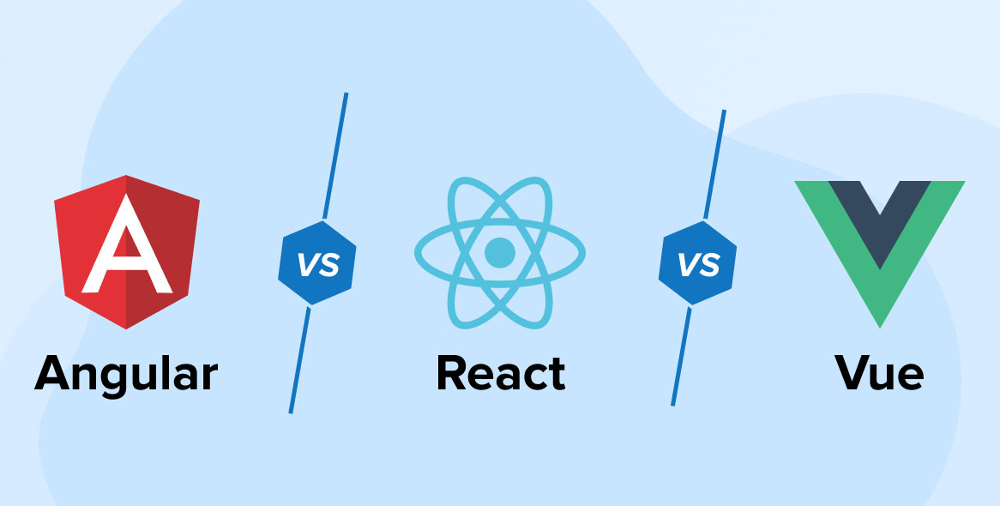
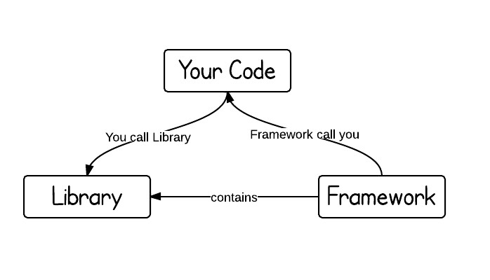
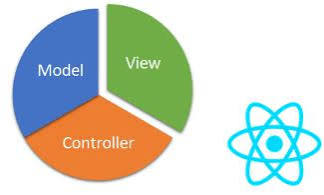
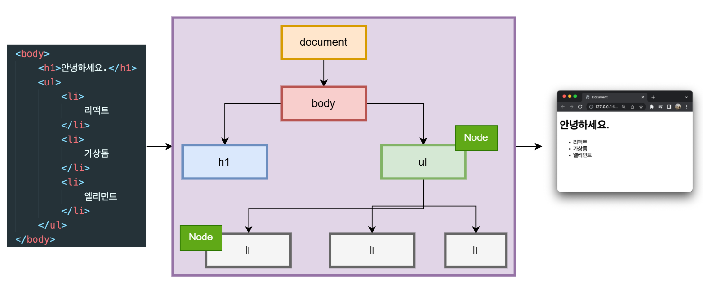
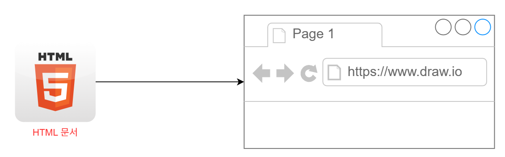
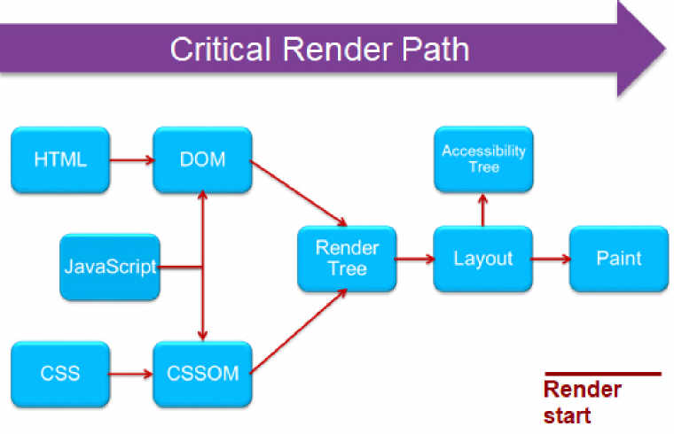
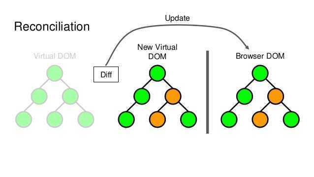
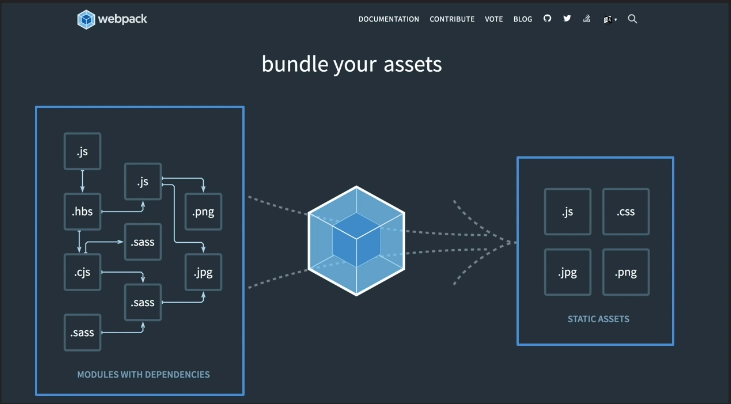

# React Notes

## 1. React 기초

### 1.1 React란 무엇인가?

**React는 사용자 인터페이스(UI)를 만들기 위한 JavaScript 라이브러리이다.**

- 인터랙션이 많은 웹 애플리케이션 개발에 주로 사용된다.
- 컴포넌트(Component) 기반으로 UI를 구성한다.
- Virtual DOM을 사용하여 효율적으로 화면을 업데이트한다.

#### React vs Vue vs Angular



- React → 라이브러리(Library)
- Vue → 프레임워크(Framework)
- Angular → 프레임워크(Framework)

#### 프레임워크와 라이브러리



##### Framework

- 애플리케이션 개발에 필요한 대부분의 기능을 제공한다.
- 프레임워크가 개발자의 코드를 호출한다.
- 예: Spring, Angular

##### Library

- 특정 기능을 제공하는 도구이다.
- 개발자가 필요할 때 호출하여 사용한다.
- 예: React, Axios, Lodash

#### React는 왜 라이브러리인가?

React는 **UI 렌더링만 담당**한다.



그 외 기능은 별도의 라이브러리를 사용한다.

- 라우팅 → React Router
- 상태 관리 → Redux, MobX, Recoil, Zustand
- HTTP 통신 → Axios
- 빌드 → Vite, Webpack
- 테스트 → Jest, Vitest

따라서 React는 완전한 프레임워크가 아닌 **UI 개발 라이브러리**이다.

---

### 1.2 React를 사용하는 이유

- 상대적으로 배우기 쉽다.
- 컴포넌트 기반으로 재사용성이 높다.
- 관련 라이브러리와 생태계가 풍부하다.
- 대규모 서비스에서 검증되었다.
- 커뮤니티가 크고 참고 자료가 많다.

---

### 1.3 React 컴포넌트

컴포넌트(Component)는 React 애플리케이션을 구성하는 **최소 단위의 UI 조각**이다.

React는 여러 컴포넌트를 조합하여 화면을 구성한다.


#### 클래스형 컴포넌트

- ES6 클래스를 사용한다.
- 과거에 주로 사용되었다.

#### 함수형 컴포넌트

- 함수를 사용하여 작성한다.
- 현재 React 개발의 표준 방식이다.
- Hooks를 사용할 수 있다.

---

### 1.4 브라우저 렌더링과 Virtual DOM

#### 브라우저 렌더링 과정

리액트의 주요 특징 중 하나는 **가상(Virtual)돔**을 사용한다는 것이다.

#### DOM(Document Object Model)

DOM은 HTML 문서를 브라우저가 이해할 수 있도록 트리 구조의 객체로 표현한 것이다.

즉, JavaScript가 웹 페이지의 요소에 접근하고 조작할 수 있도록 만든 객체 모델이다.




#### DOM 조작

DOM API를 이용하여 요소를 조회하거나 수정할 수 있다.


#### 웹 페이지 빌드 과정(Critical Rendering Path CRP)

브라우저는 HTML을 받아 화면에 표시하기까지 다음 과정을 거친다.





1. **DOM Tree 생성**
   - HTML을 파싱하여 DOM 생성

2. **CSSOM 생성**
   - CSS를 파싱하여 CSSOM 생성

3. **Render Tree 생성**
   - DOM과 CSSOM을 결합
   - 화면에 표시될 요소와 스타일 정보 포함

4. **Layout (Reflow)**
   - 각 요소의 크기와 위치 계산

5. **Paint**
   - 실제 화면에 렌더링


#### DOM 조작의 문제점

사용자의 인터랙션으로 DOM이 변경되면 브라우저는 다시 렌더링 과정을 수행한다.  
인터랙션이 많은 애플리케이션에서는 이러한 작업이 반복되어 성능 저하가 발생할 수 있다.
특히 Layout과 Paint 과정의 비용이 크다.

#### Virtual DOM

이러한 문제를 해결하기 위해 React는 Virtual DOM을 사용한다.  
Virtual DOM은 실제 DOM을 JavaScript 객체 형태로 메모리에 저장한 가상 복사본이다.

특징

- 실제 DOM과 동일한 구조를 가진다.
- 메모리에서 동작한다.
- 직접 화면을 변경하지 않는다.

#### Virtual DOM 동작 과정



리액트에서는 항상 렌더링 이전의 객체( Virtual DOM)와 렌더링 이후의 객체( Virtual DOM)를 가지고 있음. 

State(데이터)가 바뀌면  Virtual DOM이 새로 생성됨.

##### Diffing
이전 Virtual DOM과 새로운 Virtual DOM을 비교하여 변경된 부분을 찾는 과정이다.

##### Reconciliation

Diffing 결과를 실제 DOM에 반영하는 과정이다.

React는 변경된 부분만 업데이트하여 불필요한 DOM 조작을 줄인다.

#### Batch Update

React는 여러 State 변경을 하나로 묶어서 처리한다.

```jsx
setCount(count + 1);
setName("Kim");
setAge(20);
```

위와 같이 여러 상태가 변경되어도 React는 가능한 한 한 번의 렌더링으로 처리한다.

---

### 1.5 Node.js

React 프로젝트를 생성하고 개발하기 위해서는 Node.js가 필요하다.

> Node.js를 설치하면 npm(Node Package Manager)도 함께 설치된다.

#### Node.js란?

Node.js는 Chrome의 V8 엔진 기반 JavaScript 런타임이다.

브라우저 밖에서도 JavaScript를 실행할 수 있게 해준다.

#### React에서 Node.js가 필요한 이유

React는 브라우저에서 실행되지만, 개발 과정에서 사용하는 도구들이 Node.js 위에서 동작한다.


- npm 패키지 관리
- Vite 실행
- Webpack 번들링
- Babel 코드 변환
- 개발 서버 실행

---

### 1.6 리액트 앱 설치하기

#### Webpack

오픈 소스 자바스크립트 모듈 번들러로써 여러개로 나눠져 있는 파일들을 하나의 자바스크립트 코드로 압축하고 최적화하는 라이브러리



- 장점
  1.  여러 파일의 자바스크립트 코드를 압축하여 최적화 할 수 있기 때문에 로딩에 대한 네트워크 비용을 줄일 수 있다.
  2.  모듈 단위로 개발이 가능하여, 가독성과 유지보수가 쉽다.

#### Babel

최신 자바스크립트 문법을 지원하지 않는 브라우저들을 위해서 최신 문법을 구현 브라우저에서도 돌 수 있게 변환 시켜주는 라이브러리

#### Vite을 사용하여 리액트 앱 설치하기

React 앱을 빠르게 만들어주는 도구. 

**설치 명령어**
  - npm
    - 필요한 오픈소스 코드(패키지)를 다운로드하는 도구
  - npx
    - 컴퓨터에 설치 없이 최신 버전을 다운로드 후 실행, 삭제
    - 휘발성 저장(일회성)
  - vite
    - 프로젝트의 초기 폴더 구조와 뼈대를 만들어주는 빌드 도구
    - 프로젝트 생성 시에만 임시 실행
```bash
npm create vite@latest
# ↓ 내부적으로 아래와 동일하게 동작
npx create-vite@latest
```

```bash
# 실행하면 아래 질문이 나옴
? Project name:       # 프로젝트 이름 (예: my-app)
? Select a framework: # React 선택
? Select a variant:   # JavaScript 선택 (처음엔 JS 추천)
```

## 2. 간단한 To-Do 앱 만들며 리액트 익히기

### 2.1 기본 폴더 구조

```text
my-project/
├── public/                 # 정적 리소스 (이미지, 폰트 등, 빌드 시 그대로 복사됨)
│   └── vite.svg            # 기본 Vite 아이콘
├── src/                    # 실제 개발을 진행하는 소스 코드 폴더
│   ├── assets/             # 이미지, CSS 등 정적 에셋 파일
│   ├── App.css             # 기본 스타일 시트
│   ├── App.tsx (or .jsx)   # 루트 컴포넌트
│   ├── main.tsx (or .js)   # 애플리케이션 진입점(Entry point)
│   └── index.css           # 전역 스타일 시트
├── .gitignore              # Git 버전 관리에서 제외할 파일 설정
├── index.html              # 싱글 페이지 애플리케이션(SPA)의 기본 HTML 템플릿
├── package-lock.json       # 의존성 패키지의 정확한 버전 고정 파일
├── package.json            # 프로젝트 정보 및 의존성(라이브러리) 목록
├── README.md               # 프로젝트 설명 문서
└── vite.config.ts (or .js) # Vite 프로젝트의 핵심 설정 파
```
#### src 폴더

대부분의 리액트 소스 코드들을 이곳에 작성
Webpack은 src 폴더내의 파일만 처리함.

#### package.json

해당 프로젝트에 대한 정보들이 들어있다. 

```json
{
  "name": "react-todo-app",
  "private": true,
  "version": "0.0.0",
  "type": "module",
  "scripts": {
    "dev": "vite",
    "build": "vite build",
    "lint": "eslint .",
    "preview": "vite preview"
  },
  "dependencies": {
    "react": "^19.2.6",
    "react-dom": "^19.2.6"
  },
  "devDependencies": {
    "@eslint/js": "^10.0.1",
    "@types/react": "^19.2.14",
    "@types/react-dom": "^19.2.3",
    "@vitejs/plugin-react": "^6.0.1",
    "eslint": "^10.3.0",
    "eslint-plugin-react-hooks": "^7.1.1",
    "eslint-plugin-react-refresh": "^0.5.2",
    "globals": "^17.6.0",
    "vite": "^8.0.12"
  }
}
```

- scripts  
  - 리액트 앱 실행, 빌드, 테스트 등의 스트립트가 명시되어 있음
  - 프로젝트에서 자주 실행해야하는 명령어를 scripts로 작성해두면 npm명령어로 실행 가능
- dependencies  
  - 운영 환경에서 필요한 라이브러리와 그 버전들이 명시됨
- devDependencies
  - 개발 환경에서 사용한 라이브러리와 그 버전들이 명시됨

---

### 2.2 React App 실행해보기 (npm run dev)

```bash
# package.json기반 필수 라이브러리 일괄 설치
npm install

# 로컬 개발 서버 구동 (실시간 화면 확인)
npm run dev
```

### 2.3 SPA(Single Page Application)

`index.html`

```html

```


